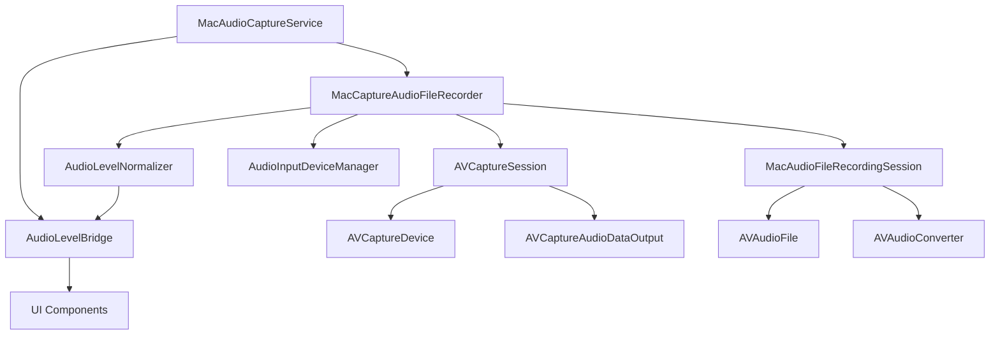

# Design Document: Audio Capture Pipeline

## Overview

本文档描述 audio-capture-pipeline 功能的技术设计。该功能负责从音频输入设备捕获音频数据，并将其写入文件以供后续转录处理。

设计目标：
- 使用 AVCaptureSession 从音频输入设备捕获音频
- 实时计算和流式传输音频电平
- 将捕获的音频转换为标准格式并写入文件
- 支持设备不可用时的自动回退策略
- 实现录音窗口激活机制（缓冲音频直到激活）
- 提供错误处理和重试逻辑
- 集成性能监控和诊断

---

## Architecture

### 系统架构图




### 当前实现

音频捕获管道由以下核心组件组成：

1. **MacAudioCaptureService** - 高级音频捕获服务
   - 管理录音生命周期（开始、停止、取消）
   - 处理麦克风权限请求
   - 配置音频会话
   - 提供音频电平流
   - 集成性能监控探针

2. **MacCaptureAudioFileRecorder** - AVCaptureSession 集成
   - 配置和管理 AVCaptureSession
   - 实现设备候选回退策略
   - 处理音频缓冲区并转换格式
   - 计算实时音频电平
   - 实现启动重试逻辑

3. **MacAudioFileRecordingSession** - 录音会话管理
   - 管理 AVAudioFile 写入
   - 实现录音窗口激活机制
   - 缓冲激活前的音频
   - 处理音频格式转换
   - 提供录音诊断信息

4. **AudioLevelBridge** - 音频电平流式传输
   - 管理多个音频电平订阅者
   - 使用 AsyncStream 提供实时电平数据
   - 线程安全的电平发射

5. **AudioLevelNormalizer** - 音频电平计算
   - 从 PCM 缓冲区计算 RMS 电平
   - 归一化电平值到 [0, 1] 范围
   - 提供最小可见电平阈值

---

## Components and Interfaces

### 1. MacAudioCaptureService

```swift
actor MacAudioCaptureService: AudioCaptureService, AudioLevelSource {
    private let audioLevelBridge: AudioLevelBridge
    private let macAudioFileRecorder: MacCaptureAudioFileRecorder
    
    private var recorder: AVAudioRecorder?
    private var recordingFileURL: URL?
    private var isRecording = false
    private var meteringTask: Task<Void, Never>?
    
    init()
    
    /// 创建音频电平流
    func makeAudioLevelStream() async -> AsyncStream<Double>
    
    /// 开始录音
    /// - Throws: SpeechServiceError.alreadyRecording, .microphonePermissionDenied, .failedToStart
    func startRecording() async throws
    
    /// 激活录音窗口（开始写入缓冲的音频）
    /// - Throws: SpeechServiceError.notRecording
    func activateRecordingWindow() async throws
    
    /// 停止录音并返回录音文件
    /// - Returns: 录音文件 URL 和持续时间
    /// - Throws: SpeechServiceError.notRecording, .emptyTranscription
    func stopRecording() async throws -> (url: URL, duration: TimeInterval?)
    
    /// 取消录音
    func cancelRecording() async
    
    /// 预热（预加载设备列表）
    func prewarm() async
    
    private func requestMicrophonePermission() async -> Bool
    private func configureAudioSession() throws
    private func startMacRecording() async throws -> AudioHardwareDevice?
    private func makeRecordingFileURL() -> URL
    private func cleanupRecordingFile()
    private func startMetering(with recorder: AVAudioRecorder)
    private func finishCaptureStreams()
}
```


### 2. MacCaptureAudioFileRecorder

```swift
nonisolated final class MacCaptureAudioFileRecorder: NSObject, @unchecked Sendable {
    private struct InputDeviceCandidate {
        let device: AudioHardwareDevice?
        let reason: Reason
        
        enum Reason: String {
            case selected                    // 用户选择的设备
            case noExplicitDeviceFallback   // 系统默认设备（无显式设备时）
            case builtInFallback            // 内置设备回退
            case systemDefaultFallback      // 系统默认设备回退
        }
    }
    
    private enum Configuration {
        static let startupRetryCount = 4
        static let startupRetryDelaySeconds = 0.15
    }
    
    private let firstBufferLock = NSLock()
    private let stateLock = NSLock()
    private let captureQueue = DispatchQueue(
        label: "Stet.MacCaptureAudioFileRecorder.capture",
        qos: .userInitiated
    )
    private let audioLevelHandler: @Sendable (Double) -> Void
    private let onFirstRecordedBufferWritten: @Sendable () -> Void
    
    private var captureResources: CaptureResources?
    private var activeSession: MacAudioFileRecordingSession?
    private var hasWrittenFirstRecordedBuffer = false
    
    init(
        audioLevelHandler: @escaping @Sendable (Double) -> Void = { _ in },
        onFirstRecordedBufferWritten: @escaping @Sendable () -> Void = {}
    )
    
    /// 开始录音到指定文件
    /// - Parameters:
    ///   - fileURL: 录音文件 URL
    ///   - outputFormat: 输出音频格式
    /// - Throws: SpeechServiceError.failedToStart
    func startRecording(to fileURL: URL, outputFormat: AVAudioFormat) throws
    
    /// 激活录音窗口（开始写入缓冲的音频）
    /// - Throws: 如果会话不存在
    func activateRecordingWindow() throws
    
    /// 停止录音并返回录音结果
    /// - Parameter fileURL: 录音文件 URL
    /// - Returns: 录音结果（包含诊断信息）
    func stopRecording(writtenFileAt fileURL: URL) async -> MacAudioFileRecordingOutcome
    
    /// 取消录音
    func cancelRecording()
    
    /// 预热（预加载设备列表）
    func prewarm()
    
    private func startRecordingAttempt(
        to fileURL: URL,
        outputFormat: AVAudioFormat,
        inputDevice: AudioHardwareDevice?,
        candidateReason: InputDeviceCandidate.Reason
    ) throws
    
    private func startCaptureSession(
        _ resources: CaptureResources,
        inputDevice: AudioHardwareDevice?,
        outputFormat: AVAudioFormat
    ) throws
    
    private func handleIncomingSampleBuffer(_ sampleBuffer: CMSampleBuffer)
    private func emitFirstRecordedBufferIfNeeded(didWriteAudioFrames: Bool)
    private func finishSession() -> MacAudioFileRecordingOutcome
    private func tearDownCaptureSession()
    private func inputDeviceCandidates() -> [InputDeviceCandidate]
    
    // 静态辅助方法
    private static func makeCaptureResources(
        for device: AVCaptureDevice,
        delegate: any AVCaptureAudioDataOutputSampleBufferDelegate,
        queue: DispatchQueue
    ) throws -> CaptureResources
    
    private static func resolveCaptureDevice(
        for device: AudioHardwareDevice?
    ) throws -> AVCaptureDevice
    
    private static func availableCaptureDevices() -> [AVCaptureDevice]
    
    private static func pcmBuffer(
        from sampleBuffer: CMSampleBuffer
    ) throws -> AVAudioPCMBuffer
    
    private static func selectedRecordingDevice(
        defaults: UserDefaults = .standard
    ) -> AudioHardwareDevice?
}
```


### 3. MacAudioFileRecordingSession

```swift
nonisolated final class MacAudioFileRecordingSession: @unchecked Sendable {
    struct BufferIngestionResult: Sendable {
        let didWriteAudioFrames: Bool
    }
    
    private enum Configuration {
        static let pendingAudioLimitSeconds: Double = 1.5
    }
    
    private let lock = NSLock()
    let outputFormat: AVAudioFormat
    private let voiceProcessingEnabled: Bool
    private let voiceProcessingFallbackReason: String?
    private var converter: AVAudioConverter?
    private var converterInputFormatSignature: String?
    private var recordingFile: AVAudioFile?
    private var writtenFrameCount: AVAudioFramePosition = 0
    private var didWriteAudio = false
    private var droppedBufferLogCount = 0
    private var hasActivatedCaptureWindow = false
    private var pendingBuffers: [AVAudioPCMBuffer] = []
    private var pendingFrameCount: AVAudioFramePosition = 0
    
    init(
        recordingFile: AVAudioFile,
        outputFormat: AVAudioFormat,
        voiceProcessingEnabled: Bool,
        voiceProcessingFallbackReason: String?
    )
    
    /// 获取或创建音频转换器快照
    /// - Parameter inputFormat: 输入音频格式
    /// - Returns: 转换器、录音文件和是否创建了新转换器
    func snapshot(
        for inputFormat: AVAudioFormat
    ) throws -> (converter: AVAudioConverter, recordingFile: AVAudioFile, didCreateConverter: Bool)?
    
    /// 接收已转换的音频缓冲区
    /// - Parameter buffer: 已转换的 PCM 缓冲区
    /// - Returns: 接收结果（是否写入了音频帧）
    func ingestConvertedBuffer(_ buffer: AVAudioPCMBuffer) throws -> BufferIngestionResult?
    
    /// 是否应该记录丢弃的缓冲区（限制日志数量）
    func shouldLogDroppedBuffer() -> Bool
    
    /// 激活录音窗口（开始写入缓冲的音频）
    func activateRecordingWindow() throws
    
    /// 关闭会话
    func close()
    
    /// 获取录音结果
    func recordingOutcome() -> MacAudioFileRecordingOutcome
    
    private func appendPendingBuffer(_ buffer: AVAudioPCMBuffer)
    private func writeLocked(_ buffer: AVAudioPCMBuffer, to recordingFile: AVAudioFile) throws
}
```

### 4. AudioLevelBridge

```swift
nonisolated final class AudioLevelBridge: @unchecked Sendable {
    private let lock = NSLock()
    private var continuations: [UUID: AsyncStream<Double>.Continuation] = [:]
    
    init()
    
    /// 创建音频电平流
    /// - Returns: 音频电平的异步流
    func makeStream() -> AsyncStream<Double>
    
    /// 发射音频电平到所有订阅者
    /// - Parameter level: 归一化的音频电平 [0, 1]
    func emit(_ level: Double)
    
    private func removeContinuation(for identifier: UUID)
    private func withContinuations<T>(_ operation: (inout [UUID: AsyncStream<Double>.Continuation]) -> T) -> T
}
```

### 5. AudioLevelNormalizer

```swift
enum AudioLevelNormalizer {
    private static let minimumVisibleLevel = 0.08
    
    /// 从 PCM 缓冲区计算归一化音频电平
    /// - Parameter buffer: PCM 音频缓冲区
    /// - Returns: 归一化电平 [0, 1]
    static func normalizedLevel(from buffer: AVAudioPCMBuffer) -> Double
    
    /// 从平均功率计算归一化电平
    /// - Parameter averagePower: 平均功率（dB）
    /// - Returns: 归一化电平 [0, 1]
    static func normalizedPowerLevel(_ averagePower: Float) -> Double
}
```

---

## Data Models

### MacAudioFileRecordingOutcome

```swift
struct MacAudioFileRecordingOutcome: Sendable {
    let writtenFrameCount: AVAudioFramePosition
    let didWriteAudio: Bool
    let captureDiagnosticsSummary: String?
    
    static let empty = Self(
        writtenFrameCount: 0,
        didWriteAudio: false,
        captureDiagnosticsSummary: nil
    )
}
```

### CaptureResources（私有）

```swift
private struct CaptureResources {
    let session: AVCaptureSession
    let output: AVCaptureAudioDataOutput
    let device: AVCaptureDevice
}
```


---

## Key Design Patterns

### 1. 设备候选回退策略

当启动录音时，系统按以下优先级尝试设备候选：

```
1. selected (用户选择的设备)
   ↓ 失败
2. noExplicitDeviceFallback (系统默认设备，无显式设备时)
   ↓ 失败
3. builtInFallback (内置设备)
   ↓ 失败
4. systemDefaultFallback (系统默认设备)
```

实现逻辑：
- 如果用户选择了设备，首先尝试该设备
- 如果选择的设备与系统默认设备匹配，添加无显式设备回退
- 如果没有选择设备，依次尝试：系统默认 → 内置设备 → 系统默认
- 每个候选失败后，等待 0.1 秒后尝试下一个
- 所有候选都失败后，抛出 `SpeechServiceError.failedToStart`

### 2. 录音窗口激活机制

录音窗口激活机制允许在用户明确开始录音之前缓冲音频：

**工作流程：**
1. 调用 `startRecording()` 开始捕获音频
2. 音频缓冲区被缓存在 `pendingBuffers` 中（最多 1.5 秒）
3. 调用 `activateRecordingWindow()` 激活录音窗口
4. 所有缓冲的音频被写入文件
5. 后续音频直接写入文件

**缓冲限制：**
- 最大缓冲时间：1.5 秒
- 超过限制时，丢弃最旧的缓冲区
- 缓冲区数量：动态（取决于缓冲区大小）

**用途：**
- 避免丢失用户开始说话前的音频
- 提供更好的用户体验（无需等待录音准备）

### 3. 启动重试逻辑

AVCaptureSession 启动可能失败，系统实现了重试机制：

**配置：**
- 重试次数：4 次
- 重试延迟：0.15 秒

**流程：**
1. 调用 `session.startRunning()`
2. 检查 `session.isRunning`
3. 如果失败，等待 0.15 秒后重试
4. 最多重试 4 次
5. 所有重试失败后，抛出 `CaptureError.failedToStartSession`

### 4. 音频格式转换

捕获的音频可能与目标格式不同，系统实现了动态格式转换：

**转换器管理：**
- 为每个输入格式创建一个 `AVAudioConverter`
- 使用格式签名缓存转换器（避免重复创建）
- 格式签名：`commonFormat:sampleRate:channelCount:isInterleaved`

**转换流程：**
1. 接收 `CMSampleBuffer` 从 AVCaptureSession
2. 转换为 `AVAudioPCMBuffer`
3. 检查是否需要创建新转换器（格式变化）
4. 使用 `LinearPCMConversion.convert()` 转换格式
5. 写入转换后的缓冲区到文件

### 5. 实时音频电平计算

系统使用 RMS（均方根）方法计算音频电平：

**计算方法：**
1. 从 PCM 缓冲区读取所有通道的样本
2. 计算所有样本的平方和
3. 除以样本总数得到均方值
4. 取平方根得到 RMS 值
5. 乘以 3.2 并限制在 [0.08, 1] 范围内

**最小可见电平：**
- 设置为 0.08，避免 UI 显示完全静音

---

## Error Handling

### 错误类型

```swift
private enum CaptureError: LocalizedError {
    case noCaptureDeviceAvailable
    case selectedDeviceUnavailable(target: String, available: [String])
    case failedToCreatePCMBuffer
    case failedToReadSampleBuffer(status: OSStatus)
    case unsupportedSampleBufferFormat
    case failedToConfigureSession(reason: String)
    case failedToStartSession(device: String)
}
```

### 错误处理策略

1. **设备不可用**
   - 场景：选择的设备不存在或无法访问
   - 处理：尝试下一个设备候选
   - 日志：记录警告，包含目标设备和可用设备列表

2. **会话启动失败**
   - 场景：AVCaptureSession 无法启动
   - 处理：重试最多 4 次，每次延迟 0.15 秒
   - 日志：记录每次尝试的结果和耗时

3. **音频缓冲区处理失败**
   - 场景：无法创建 PCM 缓冲区或读取样本
   - 处理：丢弃该缓冲区，继续处理下一个
   - 日志：限制日志数量（最多 3 次），避免日志泛滥

4. **格式转换失败**
   - 场景：无法创建音频转换器或转换失败
   - 处理：丢弃该缓冲区，记录警告
   - 日志：记录输入和输出格式信息

5. **麦克风权限被拒绝**
   - 场景：用户拒绝麦克风权限
   - 处理：抛出 `SpeechServiceError.microphonePermissionDenied`
   - 日志：记录权限状态

6. **空录音**
   - 场景：录音文件没有音频帧或文件大小过小
   - 处理：删除文件，抛出 `SpeechServiceError.emptyTranscription`
   - 日志：记录录音时长和文件大小


---

## Performance Monitoring

### 性能探针集成

系统集成了两个性能探针：

1. **DictationStartupProbe** - 启动性能监控
   - `microphonePermissionResolved` - 麦克风权限解析完成
   - `audioCaptureStarted` - 音频捕获启动完成
   - `firstBufferWritten` - 第一个缓冲区写入完成

2. **DictationRuntimeProbe** - 运行时性能监控
   - `startRecordingRequested` - 请求开始录音
   - `captureStarted` - 捕获已启动
   - `captureStartError` - 捕获启动错误
   - `audioStopRequested` - 请求停止音频
   - `captureStopped` - 捕获已停止
   - `captureCancelled` - 捕获已取消
   - `meteringStopped` - 电平监控已停止
   - `frontendCaptureSummary` - 前端捕获摘要

### 启动时序日志

当启用性能跟踪时（`MacPreferences.dictationPerfTracingEnabled`），系统记录详细的启动时序：

**记录的指标：**
- `microphonePermissionMs` - 麦克风权限请求耗时
- `captureDeviceMs` - 解析捕获设备耗时
- `recordingFileMs` - 创建录音文件耗时
- `sessionStartMs` - 启动会话耗时
- `startMacRecordingMs` - macOS 录音启动总耗时
- `startRecordingMs` - 整个录音启动流程耗时

**候选设备日志：**
- `captureRecorderStart` - 记录所有设备候选
- `captureRecorderCandidateSuccess` - 候选成功
- `captureRecorderCandidateFailed` - 候选失败
- `captureRecorderSessionStartSuccess` - 会话启动成功
- `captureRecorderSessionStartFailed` - 会话启动失败

### 捕获诊断摘要

录音结束时，系统生成诊断摘要：

```
didWriteAudio=true activated=true writtenFrames=48000 pendingFrames=0 
voiceProcessingEnabled=false fallbackReason=input-only avcapture capture
```

**包含的信息：**
- `didWriteAudio` - 是否写入了音频
- `activated` - 是否激活了录音窗口
- `writtenFrames` - 写入的音频帧数
- `pendingFrames` - 待处理的音频帧数
- `voiceProcessingEnabled` - 是否启用了语音处理
- `fallbackReason` - 回退原因（如果有）

---

## Thread Safety

### 并发模型

1. **MacAudioCaptureService**
   - 使用 `actor` 隔离
   - 所有公共方法都是 `async`
   - 内部状态受 actor 保护

2. **MacCaptureAudioFileRecorder**
   - 标记为 `nonisolated` 和 `@unchecked Sendable`
   - 使用 `NSLock` 保护共享状态
   - `captureQueue` 用于 AVCaptureSession 回调

3. **MacAudioFileRecordingSession**
   - 标记为 `nonisolated` 和 `@unchecked Sendable`
   - 使用 `NSLock` 保护所有可变状态
   - 所有公共方法都是线程安全的

4. **AudioLevelBridge**
   - 标记为 `nonisolated` 和 `@unchecked Sendable`
   - 使用 `NSLock` 保护 continuations 字典
   - `emit()` 方法可以从任何线程调用

### 锁策略

**MacCaptureAudioFileRecorder：**
- `stateLock` - 保护 `captureResources` 和 `activeSession`
- `firstBufferLock` - 保护 `hasWrittenFirstRecordedBuffer`

**MacAudioFileRecordingSession：**
- `lock` - 保护所有可变状态（单锁策略）

**AudioLevelBridge：**
- `lock` - 保护 `continuations` 字典

### 队列使用

**captureQueue：**
- 标签：`Stet.MacCaptureAudioFileRecorder.capture`
- QoS：`.userInitiated`
- 用途：AVCaptureSession 回调和会话控制

---

## Correctness Properties

*属性（Property）是系统在所有有效执行中都应该保持为真的特征或行为——本质上是关于系统应该做什么的形式化陈述。属性是人类可读规范和机器可验证正确性保证之间的桥梁。*

### Property 1: 录音前必须获得麦克风权限

*对于任何* 录音请求，如果麦克风权限未授予，`startRecording()` 必须抛出 `SpeechServiceError.microphonePermissionDenied`。

**验证需求: Requirements 1.1**

### Property 2: 录音文件包含有效音频数据

*对于任何* 成功的录音会话，`stopRecording()` 返回的文件必须包含至少 0.1 秒的音频数据且文件大小大于 64 字节。

**验证需求: Requirements 1.2**

### Property 3: 音频电平在有效范围内

*对于任何* 音频缓冲区，`AudioLevelNormalizer.normalizedLevel()` 返回的值必须在 [0.08, 1.0] 范围内。

**验证需求: Requirements 2.1**

### Property 4: 音频电平流持续发射

*对于任何* 活跃的录音会话，音频电平流必须至少每 100ms 发射一次新值。

**验证需求: Requirements 2.2**

### Property 5: 设备回退策略按顺序执行

*对于任何* 设备候选列表，如果第一个候选失败，系统必须尝试下一个候选，直到成功或所有候选都失败。

**验证需求: Requirements 3.1**

### Property 6: 录音窗口激活前音频被缓冲

*对于任何* 在 `activateRecordingWindow()` 调用前接收的音频缓冲区，该缓冲区必须被添加到 `pendingBuffers` 中。

**验证需求: Requirements 4.1**

### Property 7: 录音窗口激活后缓冲音频被写入

*对于任何* 调用 `activateRecordingWindow()` 时，所有 `pendingBuffers` 中的缓冲区必须被写入录音文件。

**验证需求: Requirements 4.2**

### Property 8: 启动失败时执行重试

*对于任何* AVCaptureSession 启动失败，系统必须重试最多 4 次，每次延迟 0.15 秒。

**验证需求: Requirements 5.1**

### Property 9: 所有候选失败后抛出错误

*对于任何* 设备候选列表，如果所有候选都失败，`startRecording()` 必须抛出 `SpeechServiceError.failedToStart`。

**验证需求: Requirements 5.2**

### Property 10: 空录音被拒绝

*对于任何* 录音会话，如果录音时长小于 0.1 秒或文件大小小于等于 64 字节，`stopRecording()` 必须删除文件并抛出 `SpeechServiceError.emptyTranscription`。

**验证需求: Requirements 6.1**

### Property 11: 取消录音清理资源

*对于任何* 调用 `cancelRecording()` 的录音会话，系统必须停止 AVCaptureSession、关闭录音文件、删除临时文件并重置所有状态。

**验证需求: Requirements 7.1**

### Property 12: 性能探针记录关键事件

*对于任何* 录音会话，系统必须记录以下性能事件：`startRecordingRequested`、`microphonePermissionResolved`、`audioCaptureStarted`、`firstBufferWritten`、`captureStopped`。

**验证需求: Requirements 8.1**


---

## Testing Strategy

### 测试方法

本功能采用**双重测试策略**：

- **Swift Testing**：用于单元测试，验证特定示例、边界情况和错误条件
- **swift-check (基于 XCTest)**：用于属性测试（Property-Based Testing），验证所有输入下的通用属性

两者互补，共同确保全面覆盖：
- Swift Testing 捕获具体的 bug 和边界情况
- 属性测试验证通用正确性

**测试范围**：
- ✅ 业务逻辑层（`MacCaptureAudioFileRecorder`、`MacAudioFileRecordingSession`）
- ✅ 音频处理（`AudioLevelNormalizer`、格式转换）
- ✅ 状态管理（录音窗口激活、缓冲区管理）
- ❌ UI 层（SwiftUI Views）- 不测试
- ❌ AVCaptureSession 集成 - 使用 mock 测试

### Swift Testing 单元测试

使用 Swift Testing 框架进行单元测试：

```swift
import Testing
@testable import Stet

@Suite("Audio Level Normalization")
struct AudioLevelNormalizerTests {
    @Test("Normalized level is within valid range")
    func normalizedLevelIsWithinRange() async throws {
        let format = AVAudioFormat(
            commonFormat: .pcmFormatFloat32,
            sampleRate: 48000,
            channels: 1,
            interleaved: false
        )!
        let buffer = AVAudioPCMBuffer(
            pcmFormat: format,
            frameCapacity: 1024
        )!
        buffer.frameLength = 1024
        
        let level = AudioLevelNormalizer.normalizedLevel(from: buffer)
        #expect(level >= 0.08)
        #expect(level <= 1.0)
    }
    
    @Test("Silent buffer returns minimum level")
    func silentBufferReturnsMinimumLevel() async throws {
        let format = AVAudioFormat(
            commonFormat: .pcmFormatFloat32,
            sampleRate: 48000,
            channels: 1,
            interleaved: false
        )!
        let buffer = AVAudioPCMBuffer(
            pcmFormat: format,
            frameCapacity: 1024
        )!
        buffer.frameLength = 1024
        
        // 所有样本为 0（静音）
        let level = AudioLevelNormalizer.normalizedLevel(from: buffer)
        #expect(level == 0.08)
    }
}

@Suite("Recording Session Management")
struct RecordingSessionTests {
    @Test("Pending buffers are limited to 1.5 seconds")
    @MainActor
    func pendingBuffersAreLimited() async throws {
        let outputFormat = AVAudioFormat(
            commonFormat: .pcmFormatInt16,
            sampleRate: 48000,
            channels: 1,
            interleaved: false
        )!
        let fileURL = FileManager.default.temporaryDirectory
            .appendingPathComponent("test-\(UUID().uuidString).wav")
        let recordingFile = try AVAudioFile(
            forWriting: fileURL,
            settings: outputFormat.settings,
            commonFormat: outputFormat.commonFormat,
            interleaved: outputFormat.isInterleaved
        )
        
        let session = MacAudioFileRecordingSession(
            recordingFile: recordingFile,
            outputFormat: outputFormat,
            voiceProcessingEnabled: false,
            voiceProcessingFallbackReason: nil
        )
        
        // 添加超过 1.5 秒的缓冲区
        let buffer = AVAudioPCMBuffer(
            pcmFormat: outputFormat,
            frameCapacity: 4800
        )!
        buffer.frameLength = 4800
        
        for _ in 0..<20 {
            _ = try session.ingestConvertedBuffer(buffer)
        }
        
        let outcome = session.recordingOutcome()
        // 验证待处理帧数不超过 1.5 秒
        #expect(outcome.writtenFrameCount == 0) // 未激活窗口
    }
}
```

### 基于属性的测试（swift-check + XCTest）

使用 **swift-check** 库进行属性测试（需要 XCTest）。

**配置要求**：
- 每个属性测试至少运行 100 次迭代
- 每个测试必须引用其对应的设计文档属性
- 标签格式：`// Feature: audio-capture-pipeline, Property {number}: {property_text}`

**属性测试实现**：

```swift
import XCTest
import SwiftCheck
@testable import Stet

class AudioCapturePipelinePropertyTests: XCTestCase {
    // Feature: audio-capture-pipeline, Property 3: 音频电平在有效范围内
    func testAudioLevelIsAlwaysInValidRange() {
        property("Audio level is always in [0.08, 1.0]") <- forAll { (samples: [Float]) in
            guard !samples.isEmpty else { return true }
            
            let format = AVAudioFormat(
                commonFormat: .pcmFormatFloat32,
                sampleRate: 48000,
                channels: 1,
                interleaved: false
            )!
            let buffer = AVAudioPCMBuffer(
                pcmFormat: format,
                frameCapacity: AVAudioFrameCount(samples.count)
            )!
            buffer.frameLength = AVAudioFrameCount(samples.count)
            
            if let channelData = buffer.floatChannelData {
                for (index, sample) in samples.enumerated() {
                    channelData[0][index] = sample
                }
            }
            
            let level = AudioLevelNormalizer.normalizedLevel(from: buffer)
            return level >= 0.08 && level <= 1.0
        }
    }
    
    // Feature: audio-capture-pipeline, Property 7: 录音窗口激活后缓冲音频被写入
    func testActivationWritesAllPendingBuffers() {
        property("Activation writes all pending buffers") <- forAll { (bufferCount: Positive<Int>) in
            let count = min(bufferCount.getPositive, 10)
            
            let outputFormat = AVAudioFormat(
                commonFormat: .pcmFormatInt16,
                sampleRate: 48000,
                channels: 1,
                interleaved: false
            )!
            let fileURL = FileManager.default.temporaryDirectory
                .appendingPathComponent("test-\(UUID().uuidString).wav")
            
            guard let recordingFile = try? AVAudioFile(
                forWriting: fileURL,
                settings: outputFormat.settings,
                commonFormat: outputFormat.commonFormat,
                interleaved: outputFormat.isInterleaved
            ) else {
                return false
            }
            
            let session = MacAudioFileRecordingSession(
                recordingFile: recordingFile,
                outputFormat: outputFormat,
                voiceProcessingEnabled: false,
                voiceProcessingFallbackReason: nil
            )
            
            let buffer = AVAudioPCMBuffer(
                pcmFormat: outputFormat,
                frameCapacity: 480
            )!
            buffer.frameLength = 480
            
            // 添加缓冲区（未激活）
            for _ in 0..<count {
                _ = try? session.ingestConvertedBuffer(buffer)
            }
            
            // 激活窗口
            try? session.activateRecordingWindow()
            
            let outcome = session.recordingOutcome()
            let expectedFrames = AVAudioFramePosition(count * 480)
            
            try? FileManager.default.removeItem(at: fileURL)
            
            return outcome.writtenFrameCount == expectedFrames
        }
    }
}
```

### 测试数据生成

为属性测试创建 `Arbitrary` 实例：

```swift
extension Float: Arbitrary {
    public static var arbitrary: Gen<Float> {
        Gen.fromElements(of: [
            -1.0, -0.5, 0.0, 0.5, 1.0,
            Float.random(in: -1.0...1.0)
        ])
    }
}
```

### 测试覆盖率目标

**覆盖率范围**：仅针对本模块（audio-capture-pipeline）的代码

- **代码覆盖率**：> 80%（仅计算本模块的代码）
- **属性测试覆盖**：所有 12 个属性都有对应的测试
- **单元测试覆盖**：所有示例场景和边界情况

**覆盖率计算范围**：
- ✅ `MacCaptureAudioFileRecorder`
- ✅ `MacAudioFileRecordingSession`
- ✅ `AudioLevelBridge`
- ✅ `AudioLevelNormalizer`
- ✅ `MacAudioCaptureService`（业务逻辑部分）
- ❌ UI 组件（Views, ViewModels）
- ❌ 项目中其他已存在的代码

**测试独立性**：
- 本模块的测试应该可以独立运行
- 不依赖项目中其他模块的测试状态
- 使用 mock/stub 隔离外部依赖（如 AVCaptureSession）

### 持续集成

- 本模块的测试在 CI 中独立运行（可以单独执行）
- 属性测试失败时，保存失败的输入用于回归测试
- 性能测试：录音启动应在 < 500ms 内完成
- 测试覆盖率报告仅针对本模块的代码

**CI 配置建议**：
```bash
# 只运行本模块的测试
swift test --filter AudioCapturePipelineTests

# 生成覆盖率报告（仅针对本模块）
swift test --enable-code-coverage --filter AudioCapturePipelineTests
```

---

## 设计决策和理由

### 1. 为什么使用 AVCaptureSession 而不是 AVAudioEngine？

**理由**：
- **设备控制**：AVCaptureSession 提供更精细的设备选择和配置
- **稳定性**：AVCaptureSession 在设备切换时更稳定
- **兼容性**：与现有的设备管理代码更好地集成
- **性能**：AVCaptureSession 在 macOS 上性能更好

### 2. 为什么实现录音窗口激活机制？

**理由**：
- **用户体验**：避免丢失用户开始说话前的音频
- **响应性**：用户无需等待录音准备完成
- **灵活性**：允许应用在准备好时才开始写入文件
- **缓冲限制**：1.5 秒的缓冲限制避免内存过度使用

### 3. 为什么使用 4 次重试和 0.15 秒延迟？

**理由**：
- **经验值**：基于实际测试，这些值在大多数情况下有效
- **平衡**：在快速启动和可靠性之间取得平衡
- **用户体验**：总重试时间约 0.6 秒，用户可以接受
- **成功率**：大多数失败在第 2-3 次重试时成功

### 4. 为什么使用 RMS 方法计算音频电平？

**理由**：
- **准确性**：RMS 反映音频的实际能量
- **平滑性**：比峰值检测更平滑
- **标准**：音频工程中的标准方法
- **性能**：计算简单，性能开销小

### 5. 为什么设置最小可见电平为 0.08？

**理由**：
- **UI 反馈**：避免 UI 显示完全静音（用户可能认为系统故障）
- **视觉效果**：提供最小的视觉反馈
- **用户体验**：让用户知道系统正在工作
- **经验值**：基于 UI 设计和用户测试

### 6. 为什么限制丢弃缓冲区日志为 3 次？

**理由**：
- **日志泛滥**：避免在持续错误时产生大量日志
- **调试信息**：3 次足以提供调试信息
- **性能**：减少日志 I/O 开销
- **可读性**：保持日志文件可读

---

## 潜在问题和缓解措施

### 问题 1：设备启动可能失败

**问题**：AVCaptureSession 启动可能因各种原因失败（设备忙、权限问题、硬件故障）。

**缓解措施**：
- 实现设备候选回退策略
- 实现启动重试逻辑（4 次重试）
- 记录详细的错误日志和性能指标
- 在所有候选失败后提供清晰的错误消息

### 问题 2：音频格式可能不匹配

**问题**：捕获的音频格式可能与目标格式不同（采样率、通道数、位深度）。

**缓解措施**：
- 实现动态音频格式转换
- 缓存转换器以提高性能
- 记录格式转换信息用于调试
- 处理转换失败并丢弃无效缓冲区

### 问题 3：缓冲区可能过多

**问题**：在录音窗口激活前，可能积累大量缓冲区，导致内存问题。

**缓解措施**：
- 限制待处理缓冲区为 1.5 秒
- 超过限制时丢弃最旧的缓冲区
- 监控待处理帧数
- 在诊断摘要中报告待处理帧数

### 问题 4：线程安全问题

**问题**：多个线程可能同时访问共享状态（录音会话、音频电平）。

**缓解措施**：
- 使用 `NSLock` 保护所有共享状态
- 使用 `actor` 隔离高级服务
- 使用专用队列处理 AVCaptureSession 回调
- 标记所有 Sendable 类型

### 问题 5：性能开销

**问题**：实时音频处理和格式转换可能消耗 CPU。

**缓解措施**：
- 使用 `.userInitiated` QoS 确保优先级
- 缓存音频转换器避免重复创建
- 限制日志数量减少 I/O
- 使用高效的 RMS 计算方法

---

## 实现状态

本设计文档描述的是**已实现**的功能。所有组件和功能都已经存在于代码库中：

- ✅ MacAudioCaptureService
- ✅ MacCaptureAudioFileRecorder
- ✅ MacAudioFileRecordingSession
- ✅ AudioLevelBridge
- ✅ AudioLevelNormalizer
- ✅ 设备候选回退策略
- ✅ 录音窗口激活机制
- ✅ 启动重试逻辑
- ✅ 音频格式转换
- ✅ 实时音频电平计算
- ✅ 性能监控集成
- ✅ 错误处理和日志

**测试状态**：
- ⚠️ 单元测试需要补充
- ⚠️ 属性测试需要实现
- ⚠️ 集成测试需要补充

**文档状态**：
- ✅ 设计文档已完成
- ✅ 需求文档已完成
- ⏳ 任务文档待创建
