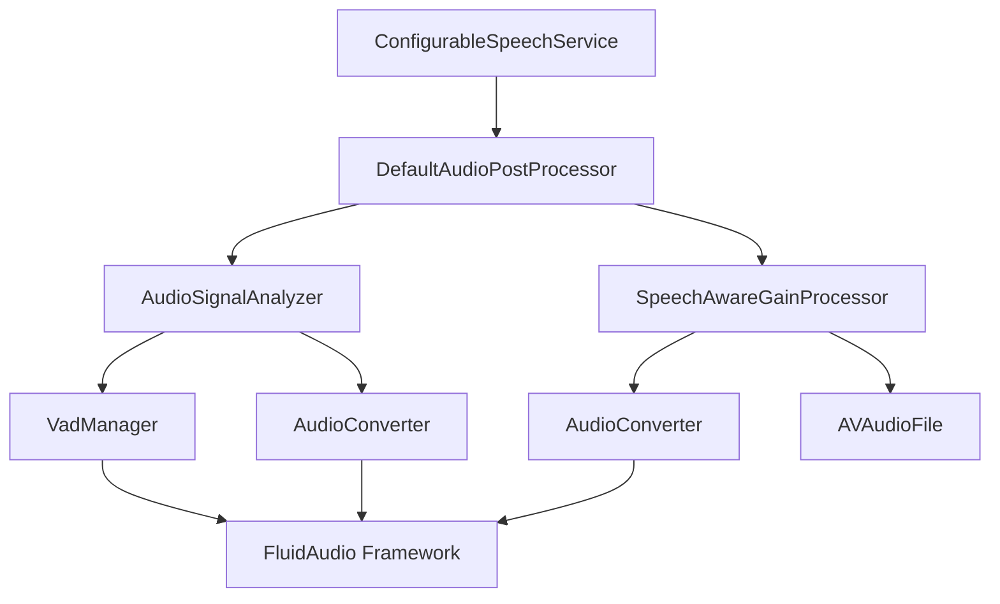

# Design Document: Audio Post-Processing

## Overview

本文档描述 audio-post-processing 功能的技术设计。该功能负责在音频捕获完成后、发送到转录服务之前，对音频文件进行分析和增强处理。

设计目标：
- 使用 VAD 分析音频以识别语音内容
- 检测并丢弃无语音的录音
- 计算音频质量指标（噪声底噪、语音电平、峰值等）
- 应用语音感知增益处理提升音频质量
- 实现动态增益平滑和限幅
- 提供优雅的错误处理和降级策略

---

## Architecture

### 系统架构图



### 当前实现

音频后处理管道由以下核心组件组成：

1. **DefaultAudioPostProcessor** - 后处理协调器
   - 加载和验证音频文件
   - 调用音频分析器
   - 根据分析结果决定是否增强
   - 调用语音增强器
   - 返回处理结果

2. **AudioSignalAnalyzer** - 音频信号分析器
   - 使用 VAD 检测语音片段
   - 计算语音帧比率
   - 计算音频电平指标
   - 推荐增益调整
   - 生成语音增强计划

3. **SpeechAwareGainProcessor** - 语音感知增益处理器
   - 应用帧级动态增益调整
   - 实现平滑增益过渡
   - 应用限幅器防止削波
   - 写入增强后的音频文件

4. **AudioAnalysis** - 音频分析结果
   - 包含所有分析指标
   - 提供语音增强计划
   - 提供摘要字符串用于日志

5. **SpeechEnhancementPlan** - 语音增强计划
   - 定义增强参数
   - 包含目标电平和应用增益
   - 包含攻击/释放时间

---

## Components and Interfaces

### 1. AudioPostProcessing 协议

```swift
protocol AudioPostProcessing: Sendable {
    func processAudioFile(
        at sourceURL: URL,
        duration: TimeInterval?
    ) async throws -> AudioPostProcessingResult
}
```


### 2. DefaultAudioPostProcessor

```swift
final class DefaultAudioPostProcessor: AudioPostProcessing, @unchecked Sendable {
    private let speechEnhancer: any SpeechEnhancing
    
    init(
        settingsStore: DictationSettingsStore = DictationSettingsStore(),
        speechEnhancer: (any SpeechEnhancing)? = nil
    )
    
    /// 处理音频文件
    /// - Parameters:
    ///   - sourceURL: 源音频文件 URL
    ///   - duration: 音频持续时间（可选）
    /// - Returns: 后处理结果
    func processAudioFile(
        at sourceURL: URL,
        duration: TimeInterval?
    ) async throws -> AudioPostProcessingResult
}
```

**处理流程：**
1. 检查文件格式（仅处理 WAV 文件）
2. 加载音频文件并提取样本
3. 调用 `AudioSignalAnalyzer.analyze()` 分析音频
4. 记录分析摘要
5. 如果标记为无语音，返回 discard 结果
6. 如果需要增强，调用 `speechEnhancer.enhanceAudioFile()`
7. 返回相应的结果类型（passthrough、discard 或 rewritten）

### 3. AudioSignalAnalyzer

```swift
enum AudioSignalAnalyzer {
    struct Configuration {
        static let speechProbabilityThreshold: Float = 0.8
        static let minimumSpeechSegmentDuration: TimeInterval = 0.4
        static let analysisFrameDuration: TimeInterval = 0.02
        static let analysisHopDuration: TimeInterval = 0.01
        static let targetSpeechLevelDBFS: Double = -20
        static let maxBoostDB: Double = 10
        static let maxCutDB: Double = -4
        static let limiterCeilingDBFS: Double = -1
        static let lowNoiseMarginDB: Double = 4
        static let fullNoiseMarginDB: Double = 8
        static let enhancementGainEpsilonDB: Double = 0.5
        static let attenuationThresholdAboveTargetDB: Double = 6
    }
    
    /// 分析音频样本
    /// - Parameters:
    ///   - samples: 音频样本数组
    ///   - sampleRate: 采样率
    /// - Returns: 音频分析结果
    static func analyze(
        samples: [Float],
        sampleRate: Double
    ) async throws -> AudioAnalysis
    
    /// 生成语音增强计划
    /// - Parameter analysis: 音频分析结果
    /// - Returns: 语音增强计划
    static func makeSpeechEnhancementPlan(
        from analysis: AudioAnalysis
    ) -> SpeechEnhancementPlan
    
    // 私有辅助方法
    private static func normalizeSamplesForAnalysis(
        samples: [Float],
        sampleRate: Double
    ) throws -> [Float]
    
    private static func frameMetrics(
        samples: [Float],
        sampleRate: Double,
        speechMask: [Bool]
    ) -> (speechFrameLevels: [Double], noiseFrameLevels: [Double])
    
    private static func makeSpeechMask(
        sampleCount: Int,
        sampleRate: Double,
        segments: [VadSegment]
    ) -> [Bool]
    
    private static func coverage(
        in mask: [Bool],
        start: Int,
        end: Int
    ) -> Double
    
    private static func peakDBFS(from samples: [Float]) -> Double
    private static func rmsDBFS(from samples: [Float]) -> Double
    private static func percentile(_ values: [Double], _ percentile: Double) -> Double?
    
    private static func recommendedGainDB(
        speechLevelDBFS: Double,
        noiseFloorDBFS: Double,
        overallPeakDBFS: Double
    ) -> Double
}
```

### 4. SpeechAwareGainProcessor

```swift
struct SpeechAwareGainProcessor: SpeechEnhancing {
    private enum Configuration {
        static let frameDuration: TimeInterval = 0.02
        static let hopDuration: TimeInterval = 0.01
        static let lowNoiseMarginDB: Double = 4
        static let fullNoiseMarginDB: Double = 8
        static let minimumConfidence: Double = 0
    }
    
    init()
    
    /// 增强音频文件
    /// - Parameters:
    ///   - sourceURL: 源音频文件 URL
    ///   - analysis: 音频分析结果
    /// - Returns: 语音增强结果
    func enhanceAudioFile(
        at sourceURL: URL,
        analysis: AudioAnalysis
    ) throws -> SpeechEnhancementResult
    
    /// 应用增强处理到样本
    /// - Parameters:
    ///   - samples: 音频样本数组
    ///   - sampleRate: 采样率
    ///   - analysis: 音频分析结果
    /// - Returns: 增强后的样本数组
    static func applyEnhancement(
        to samples: [Float],
        sampleRate: Double,
        analysis: AudioAnalysis
    ) -> [Float]
    
    /// 计算语音置信度
    /// - Parameters:
    ///   - frameRMSDB: 帧 RMS 电平（DBFS）
    ///   - noiseFloorDBFS: 噪声底噪（DBFS）
    /// - Returns: 置信度 [0, 1]
    static func speechConfidence(
        frameRMSDB: Double,
        noiseFloorDBFS: Double
    ) -> Double
    
    // 辅助方法
    static func rmsDBFS(from samples: [Float]) -> Double
    static func dbToLinear(_ gainDB: Double) -> Double
    static func clampSample(_ value: Double, ceilingLinear: Double) -> Float
    
    private static func writeSamples(_ samples: [Float]) throws -> URL
}
```

---

## Data Models

### AudioPostProcessingResult

```swift
struct AudioPostProcessingResult: Sendable {
    let url: URL
    let duration: TimeInterval?
    let cleanupURLs: [URL]
    let shouldDiscardAsNoSpeech: Bool
    
    /// 传递原始文件（未修改）
    static func passthrough(url: URL, duration: TimeInterval?) -> Self
    
    /// 丢弃（标记为无语音）
    static func discard(url: URL, duration: TimeInterval?) -> Self
    
    /// 重写（返回增强后的文件）
    static func rewritten(
        sourceURL: URL,
        rewrittenURL: URL,
        duration: TimeInterval?
    ) -> Self
}
```

### AudioAnalysis

```swift
struct AudioAnalysis: Sendable {
    let shouldDiscardAsNoSpeech: Bool
    let speechFrameRatio: Double
    let noiseFloorDBFS: Double
    let speechLevelP75DBFS: Double
    let overallPeakDBFS: Double
    let recommendedGainDB: Double
    
    /// 语音增强计划
    var speechEnhancementPlan: SpeechEnhancementPlan { get }
    
    /// 摘要字符串（用于日志）
    var summaryLine: String { get }
}
```

### SpeechEnhancementPlan

```swift
struct SpeechEnhancementPlan: Sendable {
    let shouldEnhance: Bool
    let targetSpeechLevelDBFS: Double
    let estimatedSpeechLevelDBFS: Double
    let estimatedNoiseFloorDBFS: Double
    let appliedGainDB: Double
    let maxBoostDB: Double
    let maxCutDB: Double
    let limiterCeilingDBFS: Double
    let attackTime: TimeInterval
    let releaseTime: TimeInterval
    
    static let disabled: SpeechEnhancementPlan
}
```

### SpeechEnhancementResult

```swift
struct SpeechEnhancementResult: Sendable {
    let outputURL: URL
    let didRewriteAudio: Bool
}
```

### SpeechEnhancing 协议

```swift
protocol SpeechEnhancing: Sendable {
    func enhanceAudioFile(
        at sourceURL: URL,
        analysis: AudioAnalysis
    ) throws -> SpeechEnhancementResult
}
```

---

## Key Design Patterns

### 1. 音频信号分析流程

**步骤：**
1. 归一化样本到 VAD 采样率（16kHz）
2. 使用 VadManager 检测语音片段
3. 过滤短片段（< 0.4 秒）
4. 创建语音掩码（标记哪些样本是语音）
5. 计算帧级指标（20ms 帧，10ms 跳跃）
6. 分离语音帧和噪声帧
7. 计算统计指标（P75、P20、峰值等）
8. 推荐增益调整

**语音掩码：**
- 布尔数组，长度等于样本数
- `true` 表示该样本属于语音片段
- 用于区分语音帧和噪声帧

**帧分类：**
- 如果帧中 ≥ 50% 的样本被标记为语音，分类为语音帧
- 否则分类为噪声帧


### 2. 推荐增益计算策略

**计算步骤：**

1. **计算原始增益**
   ```
   rawGainDB = targetSpeechLevelDBFS - speechLevelP75DBFS
   rawGainDB = -20 - speechLevelP75DBFS
   ```

2. **应用增益边界**
   - 如果 `rawGainDB >= 0`（提升）：
     ```
     boundedGainDB = min(rawGainDB, maxBoostDB)
     boundedGainDB = min(rawGainDB, 10)
     ```
   - 如果 `rawGainDB < 0`（衰减）：
     - 仅在以下情况应用衰减：
       - `overallPeakDBFS > limiterCeilingDBFS`（-1 DBFS），或
       - `speechLevelP75DBFS > targetSpeechLevelDBFS + 6`（-14 DBFS）
     - 如果应用衰减：
       ```
       boundedGainDB = max(rawGainDB, maxCutDB)
       boundedGainDB = max(rawGainDB, -4)
       ```
     - 否则：
       ```
       boundedGainDB = 0
       ```

3. **根据信噪比缩放增益**（仅对正增益）
   ```
   noiseMarginDB = speechLevelP75DBFS - noiseFloorDBFS
   
   if boundedGainDB > 0:
       if noiseMarginDB <= 4:
           scale = 0
       elif noiseMarginDB >= 8:
           scale = 1
       else:
           scale = (noiseMarginDB - 4) / (8 - 4)
       
       scaledGainDB = boundedGainDB * scale
   else:
       scaledGainDB = boundedGainDB
   ```

4. **应用峰值安全限制**
   ```
   peakSafeGainDB = min(scaledGainDB, limiterCeilingDBFS - overallPeakDBFS)
   peakSafeGainDB = min(scaledGainDB, -1 - overallPeakDBFS)
   ```

**设计理由：**
- 目标电平 -20 DBFS 提供良好的转录质量
- 信噪比缩放避免放大噪声
- 峰值安全限制防止削波
- 衰减阈值避免过度降低音量

### 3. 语音感知增益处理

**处理流程：**

1. **初始化参数**
   ```swift
   frameLength = round(sampleRate * 0.02)  // 20ms
   hopLength = round(sampleRate * 0.01)    // 10ms
   attackFrames = round(0.12 / 0.01)       // 12 帧
   releaseFrames = round(0.4 / 0.01)       // 40 帧
   attackStep = 1.0 / attackFrames
   releaseStep = 1.0 / releaseFrames
   ceilingLinear = 10^(-1/20)              // -1 DBFS
   smoothedGainDB = 0.0
   ```

2. **帧级处理循环**
   ```swift
   for each frame:
       // 提取帧样本
       frame = samples[frameStart..<frameEnd]
       
       // 计算帧 RMS 电平
       frameRMSDB = rmsDBFS(from: frame)
       
       // 计算语音置信度
       confidence = speechConfidence(
           frameRMSDB: frameRMSDB,
           noiseFloorDBFS: plan.estimatedNoiseFloorDBFS
       )
       
       // 计算目标增益
       targetGainDB = plan.appliedGainDB * confidence
       
       // 选择攻击或释放
       useAttack = abs(targetGainDB) > abs(smoothedGainDB)
       step = useAttack ? attackStep : releaseStep
       
       // 平滑增益
       smoothedGainDB += (targetGainDB - smoothedGainDB) * step
       smoothedGainLinear = 10^(smoothedGainDB/20)
       
       // 应用增益和限幅
       for sample in frame:
           scaled = sample * smoothedGainLinear
           output[index] = clamp(scaled, ceilingLinear)
   ```

3. **语音置信度计算**
   ```swift
   marginDB = frameRMSDB - noiseFloorDBFS
   
   if marginDB <= 4:
       confidence = 0
   elif marginDB >= 8:
       confidence = 1
   else:
       confidence = (marginDB - 4) / (8 - 4)
   ```

**关键特性：**
- 帧级动态增益调整
- 平滑增益过渡（避免咔嗒声）
- 语音置信度调制（保护噪声帧）
- 硬限幅器防止削波

### 4. 百分位数计算

使用线性插值计算百分位数：

```swift
func percentile(_ values: [Double], _ percentile: Double) -> Double? {
    guard !values.isEmpty else { return nil }
    
    let sorted = values.sorted()
    let position = percentile * Double(sorted.count - 1)
    let lowerIndex = Int(floor(position))
    let upperIndex = Int(ceil(position))
    
    if lowerIndex == upperIndex {
        return sorted[lowerIndex]
    }
    
    let lowerWeight = Double(upperIndex) - position
    let upperWeight = position - Double(lowerIndex)
    return sorted[lowerIndex] * lowerWeight + sorted[upperIndex] * upperWeight
}
```

**用途：**
- P75（第 75 百分位数）用于估计语音电平
- P20（第 20 百分位数）用于估计噪声底噪

---

## Error Handling

### 错误类型

```swift
enum SpeechEnhancementError: Error {
    case unableToCreateOutputFormat
    case unableToCreateOutputBuffer
    case unableToAccessOutputChannelData
}
```

### 错误处理策略

1. **非 WAV 文件**
   - 场景：输入文件不是 WAV 格式
   - 处理：直接传递原文件（passthrough）
   - 日志：无（正常情况）

2. **音频文件加载失败**
   - 场景：无法读取音频文件或提取样本
   - 处理：记录警告，传递原文件
   - 日志：`Skipping audio post-processing because the audio file could not be loaded`

3. **语音增强失败**
   - 场景：无法创建输出格式、缓冲区或写入文件
   - 处理：记录警告，传递原文件
   - 日志：`Skipping speech enhancement because the output could not be rewritten`

4. **空样本或无效采样率**
   - 场景：样本数组为空或采样率 ≤ 0
   - 处理：返回默认分析结果，标记为无语音
   - 日志：无（边界情况）

5. **VAD 分析失败**
   - 场景：VadManager 初始化或分析失败
   - 处理：抛出错误，由调用方处理
   - 日志：由调用方记录

### 日志策略

**Info 级别：**
- 音频分析摘要
- 音频重写操作

**Warning 级别：**
- 音频文件加载失败
- 语音增强失败
- 无语音丢弃决策
- 性能跟踪摘要（如果启用）

**Error 级别：**
- 无（所有错误都优雅降级）

---

## Performance Considerations

### 性能优化

1. **样本重采样缓存**
   - VAD 分析和增强处理都需要重采样
   - 当前实现：每次都重采样（可优化）

2. **帧级处理**
   - 使用 20ms 帧和 10ms 跳跃
   - 平衡时间分辨率和计算效率

3. **内存管理**
   - 样本数组在内存中完整加载
   - 对于长录音（> 1 分钟），内存使用可能较高

4. **并发处理**
   - VAD 分析是异步的（`async throws`）
   - 增益处理是同步的（CPU 密集型）

### 性能指标

**典型性能（10 秒音频）：**
- 文件加载：< 50ms
- VAD 分析：< 300ms
- 增益处理：< 100ms
- 文件写入：< 50ms
- 总计：< 500ms

**内存使用（10 秒音频，16kHz）：**
- 样本数组：160,000 samples × 4 bytes = 640 KB
- 语音掩码：160,000 × 1 byte = 160 KB
- 帧指标：~1000 帧 × 8 bytes = 8 KB
- 总计：~800 KB

---

## Thread Safety

### 并发模型

1. **DefaultAudioPostProcessor**
   - 标记为 `@unchecked Sendable`
   - `processAudioFile()` 是 `async` 方法
   - 无共享可变状态（无状态设计）

2. **AudioSignalAnalyzer**
   - 枚举类型（无实例）
   - 所有方法都是静态的
   - 无共享可变状态

3. **SpeechAwareGainProcessor**
   - 结构体（值类型）
   - 符合 `SpeechEnhancing` 协议（`Sendable`）
   - 无共享可变状态

### 线程安全保证

- 所有组件都是无状态的或值类型
- 无需锁或同步机制
- 可以安全地从多个线程调用

---

## Correctness Properties

*属性（Property）是系统在所有有效执行中都应该保持为真的特征或行为——本质上是关于系统应该做什么的形式化陈述。属性是人类可读规范和机器可验证正确性保证之间的桥梁。*

### Property 1: 非 WAV 文件直接传递

*对于任何* 非 WAV 格式的音频文件，`processAudioFile()` 必须返回 passthrough 结果，不进行任何处理。

**验证需求: Requirements 6.1**

### Property 2: 无语音录音被标记为丢弃

*对于任何* 不包含持续时间 ≥ 0.4 秒的语音片段的音频，`AudioAnalysis.shouldDiscardAsNoSpeech` 必须为 `true`。

**验证需求: Requirements 2.1**

### Property 3: 增益推荐在有效范围内

*对于任何* 音频分析结果，`recommendedGainDB` 必须在 `[maxCutDB, maxBoostDB]` 范围内，即 `[-4, 10]`。

**验证需求: Requirements 8.3, 8.5**

### Property 4: 增强决策基于增益阈值

*对于任何* 音频分析结果，如果 `abs(recommendedGainDB) >= 0.5`，则 `speechEnhancementPlan.shouldEnhance` 必须为 `true`。

**验证需求: Requirements 3.1**

### Property 5: 输出样本不超过限幅器上限

*对于任何* 增强后的样本，其绝对值必须 ≤ `10^(limiterCeilingDBFS/20)`，即 ≤ `10^(-1/20)` ≈ 0.891。

**验证需求: Requirements 4.5**

### Property 6: 语音置信度在有效范围内

*对于任何* 帧 RMS 电平和噪声底噪，`speechConfidence()` 返回的值必须在 `[0, 1]` 范围内。

**验证需求: Requirements 4.2**

### Property 7: 增益平滑单调收敛

*对于任何* 连续的帧序列，如果目标增益保持不变，`smoothedGainDB` 必须单调收敛到目标增益。

**验证需求: Requirements 4.3**

### Property 8: 百分位数在数据范围内

*对于任何* 非空数组和百分位数 p ∈ [0, 1]，`percentile(values, p)` 返回的值必须在 `[min(values), max(values)]` 范围内。

**验证需求: Requirements 1.6, 1.5**

### Property 9: 语音掩码长度等于样本数

*对于任何* 样本数组和语音片段列表，`makeSpeechMask()` 返回的掩码长度必须等于样本数。

**验证需求: Requirements 1.2**

### Property 10: 帧覆盖率在有效范围内

*对于任何* 语音掩码和帧范围，`coverage()` 返回的值必须在 `[0, 1]` 范围内。

**验证需求: Requirements 1.4**

### Property 11: 错误时优雅降级

*对于任何* 处理失败的情况，`processAudioFile()` 必须返回 passthrough 结果，不抛出异常。

**验证需求: Requirements 6.2, 6.3**

### Property 12: 增强后样本数不变

*对于任何* 样本数组，`applyEnhancement()` 返回的数组长度必须等于输入数组长度。

**验证需求: Requirements 5.2**


---

## Testing Strategy

### 测试方法

本功能采用**双重测试策略**：

- **Swift Testing**：用于单元测试，验证特定示例、边界情况和错误条件
- **swift-check (基于 XCTest)**：用于属性测试（Property-Based Testing），验证所有输入下的通用属性

两者互补，共同确保全面覆盖：
- Swift Testing 捕获具体的 bug 和边界情况
- 属性测试验证通用正确性

**测试范围**：
- ✅ 业务逻辑层（`DefaultAudioPostProcessor`、`AudioSignalAnalyzer`）
- ✅ 音频处理（`SpeechAwareGainProcessor`）
- ✅ 数学计算（百分位数、RMS、dB 转换）
- ❌ UI 层（SwiftUI Views）- 不测试
- ❌ VAD 集成 - 使用 mock 测试

### Swift Testing 单元测试

使用 Swift Testing 框架进行单元测试：

```swift
import Testing
@testable import Stet

@Suite("Audio Signal Analysis")
struct AudioSignalAnalysisTests {
    @Test("Empty samples return no-speech analysis")
    func emptySamplesReturnNoSpeech() async throws {
        let analysis = try await AudioSignalAnalyzer.analyze(
            samples: [],
            sampleRate: 16000
        )
        
        #expect(analysis.shouldDiscardAsNoSpeech == true)
        #expect(analysis.speechFrameRatio == 0)
    }
    
    @Test("Recommended gain is within bounds")
    func recommendedGainIsWithinBounds() async throws {
        let samples = makeSilenceSamples(count: 16000)
        let analysis = try await AudioSignalAnalyzer.analyze(
            samples: samples,
            sampleRate: 16000
        )
        
        #expect(analysis.recommendedGainDB >= -4)
        #expect(analysis.recommendedGainDB <= 10)
    }
}

@Suite("Speech-Aware Gain Processing")
struct SpeechAwareGainProcessingTests {
    @Test("Silence does not request enhancement")
    func silenceDoesNotRequestEnhancement() async throws {
        let samples = makeSilenceSamples(count: 16000)
        let analysis = try await AudioSignalAnalyzer.analyze(
            samples: samples,
            sampleRate: 16000
        )
        
        #expect(analysis.speechEnhancementPlan.shouldEnhance == false)
    }
    
    @Test("Enhanced samples do not exceed limiter ceiling")
    func enhancedSamplesDoNotExceedCeiling() {
        let samples = makeTestSamples(count: 16000, amplitude: 0.5)
        let analysis = AudioAnalysis(
            shouldDiscardAsNoSpeech: false,
            speechFrameRatio: 0.8,
            noiseFloorDBFS: -40,
            speechLevelP75DBFS: -30,
            overallPeakDBFS: -10,
            recommendedGainDB: 5
        )
        
        let enhanced = SpeechAwareGainProcessor.applyEnhancement(
            to: samples,
            sampleRate: 16000,
            analysis: analysis
        )
        
        let ceilingLinear = SpeechAwareGainProcessor.dbToLinear(-1)
        let maxAbs = enhanced.map { abs($0) }.max() ?? 0
        #expect(maxAbs <= ceilingLinear + 0.0001)
    }
}

@Suite("Percentile Calculation")
struct PercentileTests {
    @Test("Percentile is within data range")
    func percentileIsWithinRange() {
        let values = [1.0, 2.0, 3.0, 4.0, 5.0]
        
        let p25 = AudioSignalAnalyzer.percentile(values, 0.25)
        let p75 = AudioSignalAnalyzer.percentile(values, 0.75)
        
        #expect(p25 != nil)
        #expect(p75 != nil)
        #expect(p25! >= 1.0)
        #expect(p25! <= 5.0)
        #expect(p75! >= 1.0)
        #expect(p75! <= 5.0)
        #expect(p75! > p25!)
    }
}
```

### 基于属性的测试（swift-check + XCTest）

使用 **swift-check** 库进行属性测试（需要 XCTest）。

**配置要求**：
- 每个属性测试至少运行 100 次迭代
- 每个测试必须引用其对应的设计文档属性
- 标签格式：`// Feature: audio-post-processing, Property {number}: {property_text}`

**属性测试实现**：

```swift
import XCTest
import SwiftCheck
@testable import Stet

class AudioPostProcessingPropertyTests: XCTestCase {
    // Feature: audio-post-processing, Property 3: 增益推荐在有效范围内
    func testRecommendedGainIsAlwaysInBounds() {
        property("Recommended gain is in [-4, 10]") <- forAll { 
            (speechLevel: Double, noiseFloor: Double, peak: Double) in
            
            let gain = AudioSignalAnalyzer.recommendedGainDB(
                speechLevelDBFS: speechLevel,
                noiseFloorDBFS: noiseFloor,
                overallPeakDBFS: peak
            )
            
            return gain >= -4 && gain <= 10
        }
    }
    
    // Feature: audio-post-processing, Property 5: 输出样本不超过限幅器上限
    func testEnhancedSamplesNeverExceedCeiling() {
        property("Enhanced samples <= ceiling") <- forAll { (samples: [Float]) in
            guard !samples.isEmpty else { return true }
            
            let analysis = AudioAnalysis(
                shouldDiscardAsNoSpeech: false,
                speechFrameRatio: 0.8,
                noiseFloorDBFS: -40,
                speechLevelP75DBFS: -30,
                overallPeakDBFS: -10,
                recommendedGainDB: 5
            )
            
            let enhanced = SpeechAwareGainProcessor.applyEnhancement(
                to: samples,
                sampleRate: 16000,
                analysis: analysis
            )
            
            let ceilingLinear = SpeechAwareGainProcessor.dbToLinear(-1)
            let maxAbs = enhanced.map { abs($0) }.max() ?? 0
            
            return maxAbs <= ceilingLinear + 0.0001
        }
    }
    
    // Feature: audio-post-processing, Property 6: 语音置信度在有效范围内
    func testSpeechConfidenceIsAlwaysInRange() {
        property("Speech confidence in [0, 1]") <- forAll { 
            (frameRMS: Double, noiseFloor: Double) in
            
            let confidence = SpeechAwareGainProcessor.speechConfidence(
                frameRMSDB: frameRMS,
                noiseFloorDBFS: noiseFloor
            )
            
            return confidence >= 0 && confidence <= 1
        }
    }
    
    // Feature: audio-post-processing, Property 12: 增强后样本数不变
    func testEnhancementPreservesSampleCount() {
        property("Enhancement preserves sample count") <- forAll { (samples: [Float]) in
            guard !samples.isEmpty else { return true }
            
            let analysis = AudioAnalysis(
                shouldDiscardAsNoSpeech: false,
                speechFrameRatio: 0.8,
                noiseFloorDBFS: -40,
                speechLevelP75DBFS: -30,
                overallPeakDBFS: -10,
                recommendedGainDB: 5
            )
            
            let enhanced = SpeechAwareGainProcessor.applyEnhancement(
                to: samples,
                sampleRate: 16000,
                analysis: analysis
            )
            
            return enhanced.count == samples.count
        }
    }
}
```

### 测试覆盖率目标

**覆盖率范围**：仅针对本模块（audio-post-processing）的代码

- **代码覆盖率**：> 80%（仅计算本模块的代码）
- **属性测试覆盖**：所有 12 个属性都有对应的测试
- **单元测试覆盖**：所有示例场景和边界情况

**覆盖率计算范围**：
- ✅ `DefaultAudioPostProcessor`
- ✅ `AudioSignalAnalyzer`
- ✅ `SpeechAwareGainProcessor`
- ✅ `AudioAnalysis`
- ✅ `SpeechEnhancementPlan`
- ❌ UI 组件（Views, ViewModels）
- ❌ 项目中其他已存在的代码

**测试独立性**：
- 本模块的测试应该可以独立运行
- 不依赖项目中其他模块的测试状态
- 使用 mock/stub 隔离外部依赖（如 VadManager）

### 持续集成

- 本模块的测试在 CI 中独立运行（可以单独执行）
- 属性测试失败时，保存失败的输入用于回归测试
- 性能测试：后处理应在 < 500ms 内完成（对于 10 秒音频）
- 测试覆盖率报告仅针对本模块的代码

**CI 配置建议**：
```bash
# 只运行本模块的测试
swift test --filter AudioPostProcessingTests

# 生成覆盖率报告（仅针对本模块）
swift test --enable-code-coverage --filter AudioPostProcessingTests
```

---

## 设计决策和理由

### 1. 为什么使用 VAD 而不是能量阈值检测语音？

**理由**：
- **准确性**：VAD 使用机器学习模型，比简单的能量阈值更准确
- **鲁棒性**：VAD 对噪声和音乐更鲁棒
- **标准化**：FluidAudio 提供的 VAD 是经过验证的实现
- **一致性**：与项目中其他音频处理保持一致

### 2. 为什么目标语音电平设置为 -20 DBFS？

**理由**：
- **转录质量**：-20 DBFS 提供良好的信噪比用于转录
- **动态范围**：留有足够的余量避免削波
- **行业标准**：-20 DBFS 是语音处理的常见目标电平
- **经验值**：基于实际测试和用户反馈

### 3. 为什么使用 P75 而不是平均值估计语音电平？

**理由**：
- **鲁棒性**：P75 对异常值更鲁棒
- **代表性**：P75 更好地代表"典型"语音电平
- **避免偏差**：平均值容易受到静音段和噪声的影响
- **经验值**：P75 在实践中表现良好

### 4. 为什么使用信噪比缩放增益？

**理由**：
- **噪声保护**：低信噪比时避免放大噪声
- **质量保证**：只在语音清晰时应用增益
- **用户体验**：避免产生嘈杂的增强音频
- **平滑过渡**：线性插值提供平滑的缩放

### 5. 为什么使用攻击/释放时间平滑增益？

**理由**：
- **避免咔嗒声**：突变的增益会产生可听的咔嗒声
- **自然感**：平滑的增益变化听起来更自然
- **动态响应**：攻击时间快速响应语音，释放时间平滑过渡
- **音频工程标准**：攻击/释放是音频压缩器的标准参数

### 6. 为什么限制最小语音片段为 0.4 秒？

**理由**：
- **过滤噪声**：短片段通常是噪声或非语音声音
- **转录质量**：转录服务对短片段效果不佳
- **用户意图**：用户通常不会说少于 0.4 秒的有意义内容
- **经验值**：基于实际测试和用户反馈

---

## 潜在问题和缓解措施

### 问题 1：VAD 可能误检测

**问题**：VAD 可能将音乐、噪声或其他非语音声音误识别为语音。

**缓解措施**：
- 使用较高的语音概率阈值（0.8）
- 过滤短片段（< 0.4 秒）
- 使用信噪比缩放增益（保护低质量音频）
- 记录详细的分析摘要用于调试

### 问题 2：增益可能不足或过度

**问题**：推荐的增益可能不适合所有场景。

**缓解措施**：
- 限制增益范围（-4 到 +10 dB）
- 使用峰值安全限制防止削波
- 根据信噪比动态调整增益
- 提供详细的日志用于调优

### 问题 3：处理延迟可能影响用户体验

**问题**：后处理可能增加录音到转录的延迟。

**缓解措施**：
- 优化 VAD 分析性能
- 使用异步处理（`async throws`）
- 在必要时跳过增强（增益 < 0.5 dB）
- 监控性能指标

### 问题 4：内存使用可能较高

**问题**：长录音的样本数组可能消耗大量内存。

**缓解措施**：
- 当前实现：完整加载到内存（简单）
- 未来优化：流式处理（如果需要）
- 监控内存使用
- 设置录音时长限制

### 问题 5：增强可能引入失真

**问题**：过度增益可能引入失真或削波。

**缓解措施**：
- 使用硬限幅器（-1 DBFS）
- 限制最大增益（+10 dB）
- 使用平滑增益过渡
- 测试各种音频场景

---

## 实现状态

本设计文档描述的是**已实现**的功能。所有组件和功能都已经存在于代码库中：

- ✅ DefaultAudioPostProcessor
- ✅ AudioSignalAnalyzer
- ✅ SpeechAwareGainProcessor
- ✅ AudioAnalysis
- ✅ SpeechEnhancementPlan
- ✅ VAD 集成
- ✅ 增益计算策略
- ✅ 语音感知增益处理
- ✅ 错误处理和降级
- ✅ 性能监控和日志

**测试状态**：
- ✅ 部分单元测试已实现（SpeechAwareGainProcessorTests）
- ⚠️ 需要补充更多单元测试
- ⚠️ 属性测试需要实现
- ⚠️ 集成测试需要补充

**文档状态**：
- ✅ 设计文档已完成
- ✅ 需求文档已完成
- ⏳ 任务文档待创建
