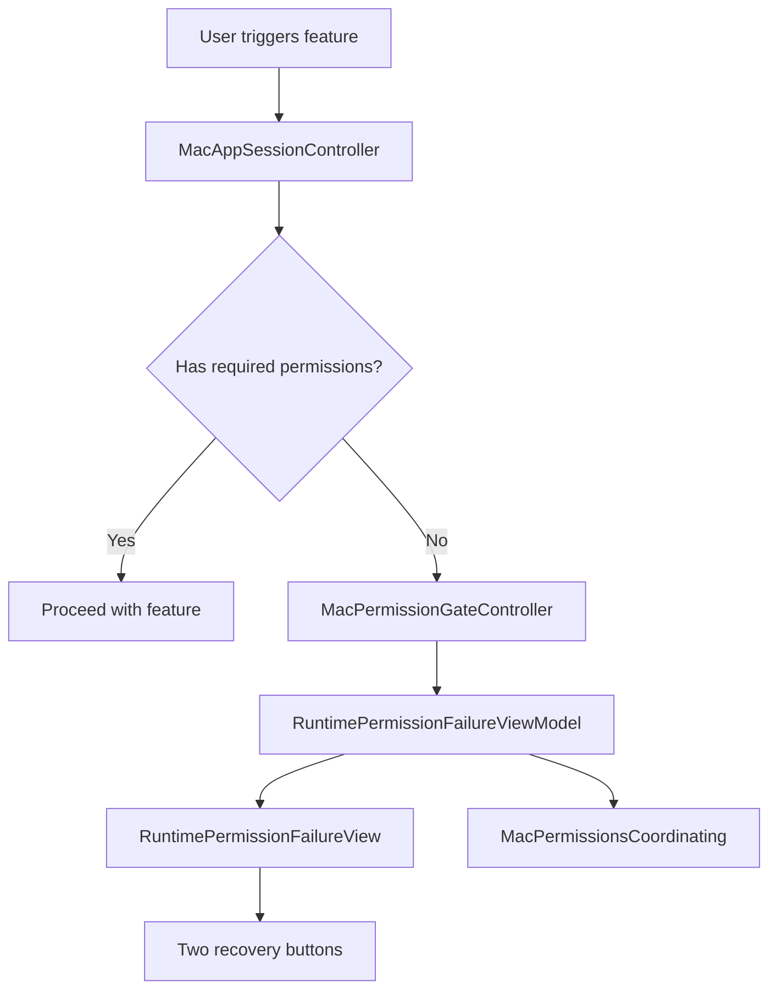

# Design Document: Permission Management

## Overview

This document describes the technical design for handling runtime permission failures in Stet on macOS.

The existing application already checks permissions before starting permission-dependent features. The missing piece is a visible recovery surface when the user tries to use a feature and Stet cannot proceed because required permissions are missing.

This design adds a minimal runtime permission-failure window.

The window is intentionally simple:

- one short explanatory message
- two primary recovery buttons

It does not attempt to become a full permission dashboard.

---

## Design Goals

- Show a clear runtime recovery surface when a permission-dependent action cannot start
- Keep the runtime permission UI minimal
- Preserve the current permission checks already implemented in `MacAppSessionController`
- Minimize changes to the existing permission architecture
- Avoid interrupting active recording or processing sessions

---

## Scope

This design covers runtime permission failure when the user attempts to use a feature but Stet cannot proceed because required permissions are missing.

Examples:

- the user presses the dictation hotkey and permissions are missing
- the user clicks the primary Start Recording action and permissions are missing

This design does not cover:

- onboarding flow UI
- general error UI for non-permission failures
- a full permission status panel
- detailed status badges or multi-row permission diagnostics

---

## Product Decision

When a user triggers a permission-dependent runtime action and the action cannot proceed, Stet shall present a standalone floating window.

That window shall contain:

1. a short explanation of why the action could not start
2. one primary microphone recovery button
3. one primary input control recovery button

The window shall not include:

- onboarding navigation
- permission status rows
- detailed status indicators
- multiple banners
- a complex permission matrix

This is a focused recovery surface, not a general settings screen.

---

## Architecture

### System Architecture Diagram



---

## Current State

Existing implementation already provides:

- permission checks in `MacAppSessionController`
- runtime branching to `presentRequiredPermissionsGateIfNeeded()`
- permission state exposed through `MacPermissionsCoordinating`

Current gap:

- `MacPermissionGateController.show()` is effectively a no-op
- runtime permission failures therefore have no dedicated visible recovery surface

---

## Design Summary

The runtime permission-failure feature will be implemented with three dedicated pieces:

1. `RuntimePermissionFailureView`
2. `RuntimePermissionFailureViewModel`
3. `MacPermissionGateController` window implementation

This is intentionally a minimal additive feature.

It does not require:

- reusing onboarding flow
- reusing onboarding ViewModel
- introducing a new permission domain abstraction
- a large refactor of `MacPermissionManager`

---

## Components and Interfaces

### File Structure

```text
apps/mac/Stet/App/
├── Windowing/
│   ├── MacPermissionGateController.swift
│   ├── RuntimePermissionFailureView.swift
│   └── RuntimePermissionFailureViewModel.swift
├── Lifecycle/
│   ├── MacPermissionManager.swift
│   └── MacAppContracts.swift
└── Workflows/
    └── MacAppSessionController.swift
```

### 1. `RuntimePermissionFailureViewModel`

This ViewModel is runtime-specific and intentionally thin.

Responsibilities:

- subscribe to `coordinator.updates`
- expose the explanatory message
- expose the two recovery button titles and actions
- request dismissal when permissions are no longer missing

Suggested shape:

```swift
@MainActor
final class RuntimePermissionFailureViewModel: ObservableObject {
    @Published private(set) var shouldDismiss = false

    private let coordinator: any MacPermissionsCoordinating
    private var cancellables = Set<AnyCancellable>()

    init(coordinator: any MacPermissionsCoordinating) {
        self.coordinator = coordinator
        coordinator.updates
            .receive(on: DispatchQueue.main)
            .sink { [weak self] _ in
                guard let self else { return }
                self.objectWillChange.send()
                self.shouldDismiss = self.hasRequiredPermissions
            }
            .store(in: &cancellables)
    }

    var hasRequiredPermissions: Bool {
        !coordinator.microphoneAccessNeedsAttention &&
        !coordinator.autoPasteAccessNeedsAttention
    }

    var messageText: String {
        "Stet can't start this action because microphone and input control permissions are required."
    }

    var microphoneButtonTitle: String {
        coordinator.microphonePermissionActionTitle
    }

    var inputControlButtonTitle: String {
        "Grant Input Control"
    }

    func resolveMicrophoneAccess() {
        coordinator.resolveMicrophoneAccess()
    }

    func requestInputControlAccess() {
        coordinator.requestAutoPasteAccess()
    }
}
```

Notes:

- this ViewModel is deliberately smaller than `OnboardingViewModel`
- it is not responsible for onboarding logic
- it is not responsible for detailed permission-state presentation

### 2. `RuntimePermissionFailureView`

This is the actual runtime recovery UI.

The view shall contain:

- a title
- a short explanation
- one microphone button
- one input control button

Suggested shape:

```swift
struct RuntimePermissionFailureView: View {
    @ObservedObject var viewModel: RuntimePermissionFailureViewModel
    let onDismiss: () -> Void

    var body: some View {
        VStack(alignment: .leading, spacing: 16) {
            Text("Permissions Required")
                .font(.title3.weight(.semibold))

            Text(viewModel.messageText)
                .font(.body)
                .foregroundStyle(.secondary)
                .fixedSize(horizontal: false, vertical: true)

            VStack(spacing: 10) {
                Button(viewModel.microphoneButtonTitle) {
                    viewModel.resolveMicrophoneAccess()
                }

                Button(viewModel.inputControlButtonTitle) {
                    viewModel.requestInputControlAccess()
                }
            }
        }
        .padding(24)
        .frame(width: 420)
        .onReceive(viewModel.$shouldDismiss.removeDuplicates()) { shouldDismiss in
            if shouldDismiss {
                onDismiss()
            }
        }
    }
}
```

UI constraints:

- no permission status rows
- no status badges
- no onboarding Back or Continue buttons
- no extra sections unless required later by implementation feedback

### 3. `MacPermissionGateController`

This controller owns the floating window and presents the runtime permission-failure view.

Responsibilities:

- show the window when runtime permission failure occurs
- avoid duplicate windows
- reuse the same window if already visible
- dismiss cleanly

Suggested shape:

```swift
@MainActor
final class MacPermissionGateController: MacPermissionGatePresenting {
    private var windowController: NSWindowController?
    private var viewModel: RuntimePermissionFailureViewModel?

    func show(appModel: any MacPermissionsCoordinating) {
        if let window = windowController?.window {
            window.makeKeyAndOrderFront(nil)
            NSApp.activate(ignoringOtherApps: true)
            return
        }

        let viewModel = RuntimePermissionFailureViewModel(coordinator: appModel)
        let rootView = RuntimePermissionFailureView(viewModel: viewModel) { [weak self] in
            self?.hide()
        }

        let hostingController = NSHostingController(rootView: rootView)
        let window = NSWindow(contentViewController: hostingController)
        window.title = "Permissions Required"
        window.styleMask = [.titled, .closable]
        window.level = .floating
        window.isReleasedWhenClosed = false
        window.center()

        let controller = NSWindowController(window: window)
        self.viewModel = viewModel
        self.windowController = controller

        controller.showWindow(nil)
        window.makeKeyAndOrderFront(nil)
        NSApp.activate(ignoringOtherApps: true)
    }

    func hide() {
        windowController?.close()
        windowController = nil
        viewModel = nil
    }
}
```

### 4. `MacAppSessionController`

`MacAppSessionController` remains the runtime trigger owner.

The goal is to preserve current behavior and replace the current no-op gate with a visible window.

Design rules:

- preserve the current permission-gated entry points
- present the runtime window when a permission-dependent action cannot proceed
- do not present the runtime window during active recording or processing

---

## Window Behavior

The runtime permission-failure window should:

- be small and focused
- float above normal app content
- be dismissible
- reappear on the next blocked attempt if permissions are still missing
- auto-close when required permissions are restored

---

## Refresh Strategy

Permission refresh remains lightweight and relies on the existing update flow.

Refresh triggers:

1. before each permission-dependent runtime action
2. when the app becomes active
3. after a recovery action is triggered
4. when coordinator updates arrive while the window is visible

The ViewModel reacts to coordinator updates. It does not own platform permission polling.

---

## Correctness Properties

### Property 1: Runtime Window Appears When Action Is Blocked By Permissions

If the user triggers a permission-dependent feature and required permissions are missing, the runtime permission-failure window shall be shown.

### Property 2: Runtime Window Does Not Interrupt Active Capture

If dictation is already active or processing, the runtime permission-failure window shall not be newly presented.

### Property 3: No Duplicate Runtime Windows

If the runtime permission-failure window is already visible, another blocked action shall not create a second window.

### Property 4: Runtime ViewModel Reuses Existing Coordinator Observation

The runtime permission-failure ViewModel shall observe coordinator updates through the existing `updates` publisher pattern.

### Property 5: Runtime Window Auto-Closes When Permissions Are Restored

If all required permissions become available while the runtime permission-failure window is visible, the window shall close automatically.

### Property 6: Runtime UI Stays Minimal

The runtime permission-failure window shall contain one explanation text block and two primary recovery buttons, and shall not introduce a full permission status panel.

---

## Error Handling

1. System permission request is denied
   - refresh state
   - keep the window visible

2. Window creation fails
   - log an error
   - show a fallback user-visible error
   - do not silently swallow the blocked action

---

## Testing Strategy

### Unit Tests

- ViewModel reflects dismissal state when permissions are restored
- ViewModel forwards microphone recovery action
- ViewModel forwards input control recovery action
- controller prevents duplicate windows

### Integration Tests

- blocked hotkey action shows runtime window
- blocked primary action shows runtime window
- restored permissions auto-close the runtime window

---

## Design Decisions

### Why a standalone window?

Because runtime permission failure is an app-level blocking condition. It should not depend on the dictation panel already being visible.

### Why a dedicated runtime View and ViewModel?

Because runtime permission failure is not onboarding. It deserves a separate implementation even if it stays visually simple.

### Why keep the UI so minimal?

Because the immediate need is recovery, not diagnosis. The user needs to understand that the action failed and needs two clear ways to proceed.

---

## Implementation Order

1. Create `RuntimePermissionFailureViewModel`
2. Create `RuntimePermissionFailureView`
3. Implement `MacPermissionGateController.show()`
4. Verify existing `MacAppSessionController` trigger points present the window correctly
5. Add focused unit and integration tests
