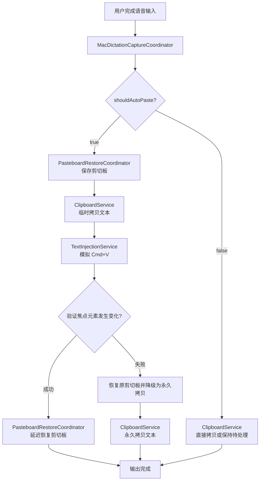
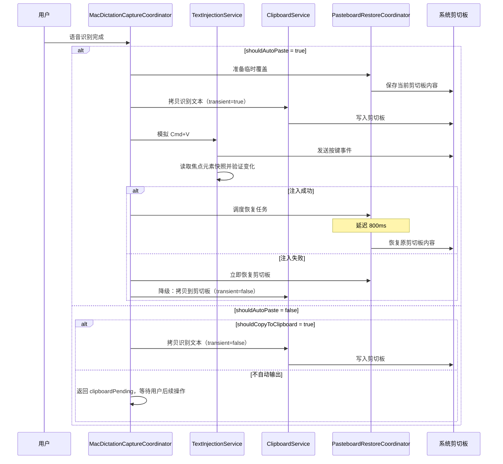

# 设计文档：文本输出处理

## 概述

本文档描述了 Stet 在 macOS 上完成语音识别后的文本输出处理功能的技术设计。

当用户完成语音输入并获得识别结果后，系统需要将识别出的文本传递给用户。该功能提供两种输出方式：

1. **剪切板输出**：将文本拷贝到系统剪切板，用户可以手动粘贴到任何应用
2. **文本注入输出**：将文本直接注入到用户当前活动的输入框

系统基于当前配置和当前焦点采用“乐观注入 + 结果验证 + 自动降级”的方式输出文本。开启自动注入时，系统会先尝试通过模拟 `Cmd+V` 将文本发送到当前焦点；如果验证失败，则自动降级到剪切板输出，确保文本不丢失。

该功能是 Stet 语音输入工作流的最后一个关键环节，必须可靠执行。

---

## 设计目标

- 提供可靠的文本输出机制，确保识别结果不丢失
- 基于当前配置和当前焦点，以最小判断成本选择最合适的输出方式
- 在文本注入时保护用户原有的剪切板内容（best effort）
- 提供清晰的降级策略和错误处理
- 保持识别文本的原始格式，不进行额外修改
- 与现有的权限管理系统集成

---

## 架构

### 系统架构图



### 数据流图



---

## 组件和接口

### 文件结构

```text
apps/mac/Stet/
├── App/Workflows/
│   └── MacDictationCaptureCoordinator.swift
├── Core/Clipboard/
│   ├── ClipboardService.swift
│   └── PasteboardRestoreCoordinator.swift
└── Core/TextInput/
    └── TextInjectionService.swift
```

### 1. MacDictationCaptureCoordinator

**职责：**
- 协调整个文本输出流程
- 根据捕获设置决定输出策略
- 处理文本注入失败时的降级逻辑
- 管理剪切板保护的生命周期

**关键接口：**

```swift
@MainActor
final class MacDictationCaptureCoordinator {
    enum CompletionOutcome: Equatable {
        case completed           // 输出完成
        case clipboardPending    // 等待用户手动粘贴
    }
    
    struct CaptureSettings {
        let shouldCopyToClipboard: Bool      // 是否拷贝到剪切板
        let shouldAutoPaste: Bool            // 是否自动注入
        let shouldRevealPanelOnCapture: Bool // 失败时是否显示面板
    }

    init(
        clipboardService: any ClipboardService,
        textInjectionService: any TextInjectionService,
        pasteboard: NSPasteboard = .general,
        pasteboardRestoreCoordinator: PasteboardRestoreCoordinator? = nil
    )
    
    func handleCompletedCapture(
        text: String,
        targetApplication: NSRunningApplication?,
        settings: CaptureSettings,
        showPanel: @escaping @MainActor () -> Void
    ) async -> CompletionOutcome
    
    func copyToClipboard(_ text: String)
}
```

**实现要点：**

1. **输出模式决策**：
   - `shouldAutoPaste = true` → 优先走文本注入流程
   - `shouldAutoPaste = false` 且 `shouldCopyToClipboard = true` → 剪切板输出
   - `shouldAutoPaste = false` 且 `shouldCopyToClipboard = false` → 返回 `clipboardPending`

2. **剪切板保护策略**：
   - 文本注入且不拷贝到剪切板：启用保护（transient=true）
   - 其他情况：不启用保护（transient=false）

3. **降级处理**：
   - 文本注入失败 → 立即恢复剪切板 → 自动降级为永久剪切板拷贝

### 2. ClipboardService

**职责：**
- 提供剪切板写入的抽象接口
- 支持 transient 标记（用于剪切板保护）
- 标记剪切板内容的来源应用

**关键接口：**

```swift
@MainActor
protocol ClipboardService {
    func copy(_ text: String, transient: Bool)
}

@MainActor
final class SystemClipboardService: ClipboardService {
    init(pasteboard: NSPasteboard = .general)
    func copy(_ text: String, transient: Bool)
}
```

**实现要点：**

1. **Transient 标记**：
   - 使用自定义 pasteboard type `org.nspasteboard.TransientType`
   - 标记临时内容，配合 PasteboardRestoreCoordinator 使用

2. **来源标记**：
   - 使用自定义 pasteboard type `org.nspasteboard.source`
   - 记录 bundle identifier，用于调试和追踪

### 3. TextInjectionService

**职责：**
- 执行文本注入（通过模拟 Cmd+V）
- 基于当前焦点验证注入是否成功
- 管理辅助功能权限

**关键接口：**

```swift
@MainActor
protocol TextInjectionService {
    var accessState: TextInjectionAccessState { get }
    var isAvailable: Bool { get }
    func requestAccess()
    func requestAccessIfNeeded()
    func openAccessibilitySettings()
    func pasteClipboard(into application: NSRunningApplication?) async -> Bool
    func selectedText() -> String?
    func replaceSelectedText(
        _ text: String,
        into application: NSRunningApplication?,
        keepResultInClipboard: Bool
    ) async -> Bool
}
```

**实现要点：**

1. **活跃输入框检测**：
   - 不单独暴露“是否存在活跃输入框”的前置判断接口
   - 在注入前后使用 AXUIElement API 读取当前焦点元素快照
   - 通过比较快照变化验证注入是否成功

2. **文本注入实现**：
   - 激活目标应用（如果指定）
   - 模拟 Cmd+V 按键事件
   - 通过比较注入前后的焦点元素状态验证成功

3. **权限管理**：
   - 检查 Accessibility 权限（`AXIsProcessTrusted()`）
   - 检查 PostEvent 权限（`CGPreflightPostEventAccess()`）
   - 至少需要一个权限才能尝试发出注入事件；可靠验证通常依赖 Accessibility 访问

### 4. PasteboardRestoreCoordinator

**职责：**
- 在文本注入前保存剪切板内容
- 在文本注入成功后延迟恢复剪切板
- 在文本注入失败时立即恢复剪切板
- 管理恢复任务的生命周期

**关键接口：**

```swift
@MainActor
final class PasteboardRestoreCoordinator {
    init(restoreDelay: Duration = .milliseconds(800))
    func prepareForTemporaryOverride(on pasteboard: NSPasteboard)
    func scheduleRestoreIfNeeded(on pasteboard: NSPasteboard)
    func restoreImmediatelyIfNeeded(on pasteboard: NSPasteboard)
    func discardPendingRestore()
}

struct PasteboardSnapshot {
    static func capture(from pasteboard: NSPasteboard) -> Self
    func matches(_ pasteboard: NSPasteboard) -> Bool
    func restore(to pasteboard: NSPasteboard)
}
```

**实现要点：**

1. **保存策略**：
   - 捕获所有 pasteboard items 和所有 types
   - 保存为 `[NSPasteboard.PasteboardType: Data]` 字典

2. **恢复策略**：
   - 延迟 800ms 后恢复（给目标应用足够时间处理粘贴）
   - 恢复前检查剪切板是否被用户修改
   - 如果已修改，取消恢复（避免覆盖用户新内容）

3. **Best Effort 语义**：
   - 不保证原子性
   - 不保证所有数据类型都能完美恢复
   - 失败不影响文本注入的执行

---

## 数据模型

### TextInjectionAccessState

```swift
struct TextInjectionAccessState: Equatable {
    let hasAccessibilityAccess: Bool  // Accessibility 权限
    let hasPostEventAccess: Bool      // PostEvent 权限
    
    var canSimulateInput: Bool {
        hasAccessibilityAccess || hasPostEventAccess
    }
}
```

### CaptureSettings

```swift
struct CaptureSettings {
    let shouldCopyToClipboard: Bool      // 用户设置：是否拷贝到剪切板
    let shouldAutoPaste: Bool            // 用户设置：是否自动注入
    let shouldRevealPanelOnCapture: Bool // 用户设置：失败时是否显示面板
}
```

### PasteboardSnapshot

```swift
struct PasteboardSnapshot {
    private let items: [[NSPasteboard.PasteboardType: Data]]
    
    // 捕获当前剪切板状态
    static func capture(from pasteboard: NSPasteboard) -> Self
    
    // 检查剪切板是否与快照匹配
    func matches(_ pasteboard: NSPasteboard) -> Bool
    
    // 恢复剪切板到快照状态
    func restore(to pasteboard: NSPasteboard)
}
```

---

## 正确性属性

*属性是一个特征或行为，应该在系统的所有有效执行中保持为真——本质上是关于系统应该做什么的形式化陈述。属性是人类可读规范和机器可验证正确性保证之间的桥梁。*

### 属性 1：输出模式选择一致性

*对于任何*识别文本和捕获设置，当 `shouldAutoPaste = true` 时系统应该优先尝试文本注入；当 `shouldAutoPaste = false` 且 `shouldCopyToClipboard = true` 时系统应该执行剪切板输出；当两者都为 `false` 时系统应该返回待处理状态而不执行系统写入。

**验证需求：1.2, 1.3**

### 属性 2：每次输出前重新检测

*对于任何*连续的文本注入操作序列，每次注入尝试都应该重新获取当前焦点元素快照，而不是复用上一次的验证上下文。

**验证需求：1.4**

### 属性 3：剪切板输出的文本完整性

*对于任何*识别文本，当使用剪切板输出时，拷贝到剪切板的内容应该与原始识别文本完全相同（往返属性）。

**验证需求：2.1, 2.3, 2.4, 7.1, 7.2, 7.3, 7.4**

### 属性 4：剪切板内容持久性

*对于任何*成功的永久剪切板输出操作，Stet 不应该主动清空或再次覆盖该剪切板内容，除非后续显式执行新的剪切板写入。

**验证需求：2.2**

### 属性 5：文本注入前权限验证

*对于任何*文本注入操作，系统应该在执行注入前验证文本注入权限是否可用。

**验证需求：3.2**

### 属性 6：文本注入的文本完整性

*对于任何*识别文本，当使用文本注入输出时，注入到输入框的内容应该与原始识别文本完全相同（往返属性）。

**验证需求：3.1, 3.3, 3.4, 7.1, 7.2, 7.3, 7.4**

### 属性 7：注入后光标位置

*对于任何*成功的文本注入操作，注入完成后输入框的插入点应该位于已注入文本之后。

**验证需求：3.5**

### 属性 8：剪切板保护往返

*对于任何*文本注入操作（transient=true），如果注入成功且用户未修改剪切板，则注入前后的剪切板内容应该保持一致（往返属性）。

**验证需求：4.1, 4.2, 4.3**

### 属性 9：剪切板恢复失败不影响注入

*对于任何*文本注入操作，即使剪切板恢复失败，文本注入本身也应该成功完成。

**验证需求：4.4**

### 属性 10：注入失败自动降级

*对于任何*文本注入失败的情况，系统应该在恢复临时剪切板后自动执行永久剪切板拷贝。

**验证需求：5.5**

### 属性 11：空文本不执行输出

*对于任何*空字符串、仅包含空白字符或 null 的识别文本，系统不应该执行任何输出操作。

**验证需求：6.1, 6.3**

---

## 错误处理

### 1. 剪切板操作失败

**场景**：系统剪切板被其他应用占用或系统资源不足

**处理策略**：
- 当前实现将剪切板写入视为同步 best effort 操作
- `SystemClipboardService` 本身不负责用户提示和重试 UI
- 如果未来需要显式失败处理，应由更高层协调器补充错误上报

**实现位置**：`SystemClipboardService.copy(_:transient:)`

### 2. 文本注入权限缺失

**场景**：用户未授予 Accessibility 或 PostEvent 权限

**处理策略**：
- 检查 `TextInjectionService.isAvailable`
- 调用 `requestAccessIfNeeded()` 提示用户授权
- 自动降级到剪切板输出
- 如果 `shouldRevealPanelOnCapture = true`，显示面板提示用户

**实现位置**：`MacDictationCaptureCoordinator.handleCompletedCapture(...)`

### 3. 文本注入失败（无法找到输入框）

**场景**：注入时输入框焦点丢失或目标应用不响应

**处理策略**：
- 通过比较注入前后的输入框快照检测失败
- 立即恢复剪切板（如果启用了保护）
- 自动降级到永久剪切板输出
- 如果 `shouldRevealPanelOnCapture = true`，显示面板

**实现位置**：`TextInjectionService.pasteClipboard(into:)` + `MacDictationCaptureCoordinator.handleCompletedCapture(...)`

### 4. 剪切板恢复失败

**场景**：恢复时剪切板状态异常或数据损坏

**处理策略**：
- 记录错误日志
- 不影响文本注入的执行结果
- 不向用户显示错误（best effort 语义）

**实现位置**：`PasteboardRestoreCoordinator.scheduleRestoreIfNeeded(on:)`

### 5. 空文本输入

**场景**：识别结果为空字符串、空白字符或 null

**处理策略**：
- 不执行任何输出操作
- 返回空转录错误或跳过输出
- 记录日志信息

**实现位置**：`MacDictationWorkflowController.handleCompletedResult(...)` + `MacDictationCaptureCoordinator.handleCompletedCapture(...)`

### 6. 目标应用无响应

**场景**：文本注入时目标应用崩溃或无响应

**处理策略**：
- 设置合理的超时时间（180ms 验证延迟）
- 超时后判定为注入失败
- 执行标准的降级流程

**实现位置**：`TextInjectionService.pasteClipboard(into:)`

---

## 测试策略

### 单元测试和基于属性的测试

本功能采用双重测试方法：

- **单元测试**：验证特定示例、边缘情况和错误条件
- **基于属性的测试**：通过随机化验证所有输入的通用属性

两者是互补的，共同提供全面的覆盖：
- 单元测试捕获具体的 bug
- 基于属性的测试验证一般正确性

### 单元测试重点

1. **输出模式选择**：
   - `shouldAutoPaste = true` 时优先尝试文本注入
   - 自动注入失败时降级到永久剪切板拷贝
   - `shouldAutoPaste = false` 时根据 `shouldCopyToClipboard` 决定直接拷贝还是进入待处理状态

2. **剪切板保护**：
   - transient=true 时启用保护
   - transient=false 时不启用保护
   - 注入成功后延迟恢复
   - 注入失败后立即恢复

3. **错误处理**：
   - 空文本不执行输出
   - 注入失败自动降级
   - 权限缺失时提示用户

4. **边缘情况**：
   - 空字符串、空白字符、null
   - 多行文本
   - 特殊字符和 Unicode
   - 目标应用无响应

### 基于属性的测试

**测试库**：Swift Testing 框架 + 自定义属性测试工具

**配置**：每个属性测试至少运行 100 次迭代

**标记格式**：`// Feature: text-output-handling, Property {number}: {property_text}`

**属性测试用例**：

1. **属性 1：输出模式选择一致性**
   ```swift
   // Feature: text-output-handling, Property 1: 输出模式选择一致性
   // 生成随机的捕获设置和识别文本
   // 验证协调器按照 capture settings 选择注入、拷贝或待处理路径
   ```

2. **属性 3：剪切板输出的文本完整性**
   ```swift
   // Feature: text-output-handling, Property 3: 剪切板输出的文本完整性
   // 生成随机的识别文本（包括多行、特殊字符、Unicode）
   // 拷贝到剪切板后读取
   // 验证内容完全相同
   ```

3. **属性 6：文本注入的文本完整性**
   ```swift
   // Feature: text-output-handling, Property 6: 文本注入的文本完整性
   // 生成随机的识别文本
   // 注入到测试输入框
   // 验证输入框内容与原始文本相同
   ```

4. **属性 8：剪切板保护往返**
   ```swift
   // Feature: text-output-handling, Property 8: 剪切板保护往返
   // 生成随机的原始剪切板内容
   // 执行文本注入（transient=true）
   // 等待恢复完成
   // 验证剪切板内容恢复到原始状态
   ```

5. **属性 10：注入失败自动降级**
   ```swift
   // Feature: text-output-handling, Property 10: 注入失败自动降级
   // 生成随机的识别文本
   // 模拟注入失败（权限缺失、验证失败、目标应用无响应等）
   // 验证临时剪切板已恢复，且文本已被永久拷贝到剪切板
   ```

6. **属性 11：空文本不执行输出**
   ```swift
   // Feature: text-output-handling, Property 11: 空文本不执行输出
   // 生成随机的空白文本（空字符串、空格、制表符、换行符组合）
   // 执行输出操作
   // 验证剪切板和输入框都未被修改
   ```

### 集成测试

1. **完整输出流程**：
   - 模拟语音识别完成
   - 验证输出模式选择
   - 验证文本正确输出

2. **降级流程**：
   - 模拟注入失败
   - 验证自动降级到剪切板
   - 验证剪切板内容正确

3. **权限集成**：
   - 模拟权限缺失
   - 验证权限提示
   - 验证降级行为

---

## 设计决策

### 为什么使用模拟 Cmd+V 而不是直接 API？

macOS 没有提供通用的文本注入 API。使用模拟按键的方式：
- 兼容性最好，适用于几乎所有应用
- 不需要针对不同应用做特殊处理
- 用户体验与手动粘贴一致

### 为什么需要剪切板保护？

文本注入依赖剪切板作为中转，会临时覆盖用户的剪切板内容。剪切板保护确保：
- 用户的工作流不被打断
- 用户可以继续使用之前复制的内容
- 提供更好的用户体验

### 为什么是 best effort 而不是保证？

剪切板是系统级共享资源，无法保证原子性：
- 其他应用可能随时修改剪切板
- 某些数据类型可能无法完美序列化
- 系统资源限制可能导致恢复失败

因此采用 best effort 策略，在大多数情况下工作良好，失败时不影响核心功能。

### 为什么延迟 800ms 恢复剪切板？

给目标应用足够时间处理粘贴事件：
- 某些应用处理粘贴需要时间
- 过早恢复可能导致应用读取到错误的剪切板内容
- 800ms 是经过测试的平衡值

### 为什么注入失败时自动降级？

确保文本不丢失：
- 注入失败的原因多样（权限、焦点丢失、应用无响应等）
- 自动降级提供可靠的后备方案
- 用户可以手动粘贴，不会丢失识别结果

### 为什么使用 transient 标记？

区分临时内容和永久内容：
- transient=true：临时中转，应该被恢复
- transient=false：用户明确要求拷贝，不应该被恢复
- 配合 PasteboardRestoreCoordinator 实现智能恢复

---

## 实现顺序

当前已有部分实现，本设计文档定义目标实现和后续对齐方向；已落地部分应尽量向本文档收敛，必要时允许小范围重构。

如果需要修改或扩展功能，建议按以下顺序：

1. 修改 `ClipboardService` 接口和实现
2. 修改 `TextInjectionService` 的检测和注入逻辑
3. 修改 `PasteboardRestoreCoordinator` 的保护策略
4. 修改 `MacDictationCaptureCoordinator` 的协调逻辑
5. 添加或更新单元测试
6. 添加或更新基于属性的测试
7. 进行集成测试验证

---

## 与其他模块的集成

### 权限管理模块

- 依赖 `MacPermissionsCoordinating` 检查权限状态
- 调用 `requestAutoPasteAccess()` 请求权限
- 权限缺失时自动降级，不阻塞输出

### 语音识别模块

- 接收识别完成的文本结果
- 不关心识别过程的细节
- 假设传入的文本已经过验证

### UI 模块

- 在输出失败时可能显示面板
- 通过 `showPanel` 回调通知 UI
- UI 决策由 `CaptureSettings.shouldRevealPanelOnCapture` 控制

---

## 性能考虑

### 剪切板操作

- 剪切板读写是同步操作，通常很快（< 10ms）
- 大量数据可能导致延迟，但语音识别文本通常不大
- 不需要特殊的性能优化

### 文本注入

- 激活目标应用：180ms 延迟
- 模拟按键：< 1ms
- 验证延迟：60ms + 180ms
- 总延迟：约 420ms，用户可接受

### 剪切板恢复

- 延迟 800ms 执行，不阻塞主流程
- 使用 Task 异步执行，不影响性能
- 失败时静默处理，不影响用户体验

---

## 安全考虑

### 剪切板内容

- 剪切板内容可能包含敏感信息
- 不记录剪切板内容到日志
- 不上传剪切板内容到服务器

### 权限

- 需要 Accessibility 或 PostEvent 权限
- 权限请求由权限管理模块统一处理
- 权限缺失时提供清晰的提示

### 目标应用

- 不验证目标应用的身份
- 信任用户当前焦点的应用
- 不限制可以注入的应用类型

---

## 未来扩展

以下功能可能在未来版本中考虑：

1. **富文本支持**：支持格式化文本的输出
2. **输出历史**：记录最近的输出内容
3. **自定义快捷键**：允许用户自定义注入快捷键
4. **应用白名单/黑名单**：控制哪些应用可以使用文本注入
5. **输出模板**：支持文本输出前的格式化模板
6. **多剪切板支持**：与第三方剪切板管理工具集成

---

## 参考资料

- [macOS Accessibility API](https://developer.apple.com/documentation/applicationservices/axuielement)
- [NSPasteboard Documentation](https://developer.apple.com/documentation/appkit/nspasteboard)
- [CGEvent Documentation](https://developer.apple.com/documentation/coregraphics/cgevent)
- Stet 权限管理模块设计文档
