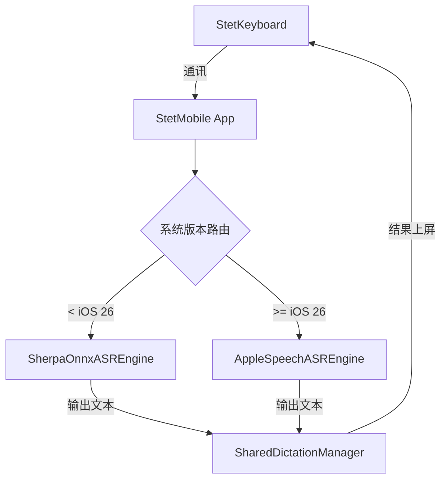

# ASR 并行引擎集成方案 (iOS 26+)

本文档描述了如何在 StetMobile 主 App 内部实现双 ASR 引擎（Sherpa-ONNX 与 Apple SpeechAnalyzer）并行运行的架构方案。

## 1. 核心设计理念

- **平行引擎**: `AppleSpeechASREngine` 与 `SherpaOnnxASREngine` 在 App 后端处于平等的地位。
- **动态分流**: App 根据当前运行的 iOS 版本号，决定激活哪一个引擎。
- **透明交互**: 键盘扩展 (StetKeyboard) 无需关心后端使用了哪个引擎。

## 2. ASR 引擎架构图 (Main App)



## 3. 引擎抽象定义

我们将 ASR 逻辑抽象为 `ASREngine` 协议：

```swift
protocol ASREngine {
    func start(sessionId: String) async
    func stop()
    var resultStream: AsyncStream<ASRResult> { get }
}
```

## 4. 并行引擎说明

### 4.1 SherpaOnnxASREngine (SenseVoice)
- **技术栈**: 基于 Sherpa-ONNX 与 SenseVoice 模型。
- **特性**: 跨版本稳定性高，支持自定义 VAD 逻辑。
- **运行环境**: 所有支持的 iOS 版本。

### 4.2 AppleSpeechASREngine (SpeechAnalyzer)
- **技术栈**: 基于 iOS 26+ 原生 Speech 框架。
- **特性**: 深度集成系统音频链路，高性能，低功耗。
- **运行环境**: iOS 26 及以上版本。

## 5. 数据交换

无论激活哪个引擎，最终识别结果均通过 `SharedDictationManager` 进行持久化同步，确保键盘端逻辑的统一。
