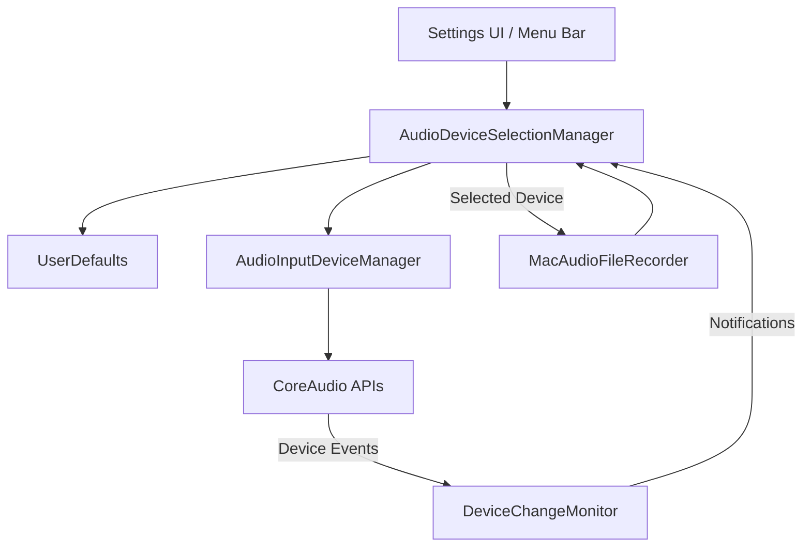

# Design Document: Audio Device Management

## Overview

本文档描述 audio-device-management 功能的技术设计。该功能扩展了现有的音频设备管理能力，支持设备枚举、选择、持久化偏好设置，以及智能设备质量优先级选择。

设计目标：
- 枚举所有可用的音频输入设备
- 支持用户手动选择特定设备
- 持久化用户的设备偏好
- 实现智能设备质量优先级（优先选择高质量设备，避免低质量蓝牙设备）
- 在设备不可用时自动回退到系统默认设备
- 提供设备热插拔监听能力

---

## Architecture

### 系统架构图



### 当前状态

`AudioInputDeviceManager` 目前仅提供：
- `defaultInputDeviceID()` - 获取系统默认输入设备 ID
- `defaultInputDevice()` - 获取系统默认输入设备及元数据

`MacAudioFileRecorder` 在录音时：
- 使用 `AudioInputDeviceManager.defaultInputDevice()` 获取设备
- 通过 `inputNode.auAudioUnit.setDeviceID()` 设置设备

### 设计变更

我们将创建以下新组件：

1. **AudioInputDeviceManager 扩展**
   - 枚举所有可用输入设备
   - 按设备 ID 或 UID 查询设备
   - 验证设备是否仍然可用

2. **AudioDeviceSelectionManager（新）**
   - 管理用户的设备选择偏好
   - 实现智能设备质量优先级逻辑
   - 处理设备不可用时的回退策略
   - 提供设备选择的统一接口

3. **AudioDeviceChangeMonitor（新）**
   - 监听设备连接/断开事件
   - 发布设备变更通知

4. **Settings UI 集成**
   - 在 General Settings 中添加设备选择 UI
   - 在 Menu Bar 中添加快速设备切换菜单
   - 添加麦克风测试功能
   - 显示当前选中的设备

5. **Onboarding 集成**
   - 在 Onboarding 流程中添加麦克风测试步骤

---

## Components and Interfaces

### 1. AudioInputDeviceManager 扩展

```swift
enum AudioInputDeviceManager {
    // 现有方法（保持不变）
    static func defaultInputDeviceID() -> AudioDeviceID?
    static func defaultInputDevice() -> AudioHardwareDevice?
    
    // 新增方法
    
    /// 获取所有可用的音频输入设备
    /// - Returns: 输入设备数组，如果查询失败返回空数组
    static func allInputDevices() -> [AudioHardwareDevice]
    
    /// 根据设备 ID 获取设备信息
    /// - Parameter deviceID: 设备 ID
    /// - Returns: 设备信息，如果设备不存在返回 nil
    static func inputDevice(id: AudioDeviceID) -> AudioHardwareDevice?
    
    /// 根据设备 UID 获取设备信息
    /// - Parameter uid: 设备 UID（持久化标识符）
    /// - Returns: 设备信息，如果设备不存在返回 nil
    static func inputDevice(uid: String) -> AudioHardwareDevice?
    
    /// 检查设备是否有输入通道
    /// - Parameter deviceID: 设备 ID
    /// - Returns: 如果设备有输入通道返回 true
    static func hasInputChannels(deviceID: AudioDeviceID) -> Bool
}
```

### 2. AudioDeviceSelectionManager（新组件）

```swift
/// 定义获取音频设备的接口（解耦 CoreAudio，便于单元测试依赖注入）
public protocol AudioDeviceProviding: Sendable {
    func allInputDevices() -> [AudioHardwareDevice]
    func defaultInputDevice() -> AudioHardwareDevice?
}

/// 默认的系统硬件实现
public struct SystemAudioDeviceProvider: AudioDeviceProviding {
    public func allInputDevices() -> [AudioHardwareDevice] { AudioInputDeviceManager.allInputDevices() }
    public func defaultInputDevice() -> AudioHardwareDevice? { AudioInputDeviceManager.defaultInputDevice() }
}

/// 管理音频设备选择和偏好设置
@MainActor
final class AudioDeviceSelectionManager: ObservableObject {
    static let shared = AudioDeviceSelectionManager(provider: SystemAudioDeviceProvider())
    
    private let provider: AudioDeviceProviding
    
    /// 当前用于录音的设备快照（跨线程安全读取，防止 startRecording 异步传染）
    let recordingDeviceLock = NSLock()
    private var _cachedRecordingDevice: AudioHardwareDevice?
    
    /// 当前选中的设备（考虑用户偏好和智能选择）
    @Published private(set) var selectedDevice: AudioHardwareDevice? {
        didSet {
            // 同步更新跨线程缓存
            recordingDeviceLock.lock()
            _cachedRecordingDevice = selectedDevice
            recordingDeviceLock.unlock()
        }
    }
    
    /// 所有可用的输入设备
    @Published private(set) var availableDevices: [AudioHardwareDevice] = []
    
    /// 设备选择策略
    enum SelectionStrategy: String, Codable {
        case automatic      // 自动选择（质量优先）
        case manual         // 用户手动选择
    }
    
    /// 当前选择策略
    @Published var strategy: SelectionStrategy
    
    /// 用户手动选择的设备 UID（仅在 manual 策略下使用）
    @Published var preferredDeviceUID: String?
    
    init(provider: AudioDeviceProviding = SystemAudioDeviceProvider())
    
    /// 同步获取录音设备（供非主线程抛出函数或同步录音方法使用，避免 async 传染链）
    nonisolated func currentRecordingDevice() -> AudioHardwareDevice?
    
    /// 刷新可用设备列表
    func refreshDevices()
    
    /// 手动选择设备
    /// - Parameter device: 要选择的设备
    func selectDevice(_ device: AudioHardwareDevice)
    
    /// 重置为自动选择
    func resetToAutomatic()
    
    /// 获取应该使用的设备（供内部逻辑评估）
    /// - Returns: 选中的设备，如果没有可用设备返回 nil
    func deviceForRecording() -> AudioHardwareDevice?
    
    /// 根据优先级选择默认设备
    /// - Parameter devices: 可用设备列表
    /// - Returns: 优先级最高的设备
    private func selectDefaultDevice(from devices: [AudioHardwareDevice]) -> AudioHardwareDevice?
}
```

### 3. AudioDeviceChangeMonitor（新组件）

```swift
/// 监听音频设备变更事件
final class AudioDeviceChangeMonitor {
    static let shared = AudioDeviceChangeMonitor()
    
    /// 设备变更通知
    static let devicesDidChangeNotification = Notification.Name("AudioDevicesDidChange")
    
    private let stateLock = NSLock()
    private var propertyListenerBlock: AudioObjectPropertyListenerBlock?
    private var monitorClientCount = 0
    private var isMonitoring = false
    
    init()
    
    /// 开始监听设备变更（支持多次调用，使用引用计数）
    func startMonitoring()
    
    /// 停止监听（支持多次调用，使用引用计数）
    func stopMonitoring()
    
    deinit
}
```

### 4. MacAudioFileRecorder 集成

修改 `MacAudioFileRecorder.startRecording()` 以使用 `AudioDeviceSelectionManager`：

```swift
// 当前实现
let inputDevice = AudioInputDeviceManager.defaultInputDevice()

// 修改为（使用跨线程安全的同步方法，避免迫使 startRecording 改为 async 并导致大规模重构）
let inputDevice = AudioDeviceSelectionManager.shared.currentRecordingDevice()
```

### 5. Settings UI 组件

#### 设备选择部分

在 `MacGeneralSettingsView` 中添加设备选择部分：

```swift
struct AudioInputDeviceSettingsSection: View {
    @ObservedObject var deviceManager: AudioDeviceSelectionManager
    @StateObject private var microphoneTestViewModel: MicrophoneTestViewModel
    
    var body: some View {
        Section("Audio Input Device") {
            Picker("Selection Strategy", selection: selectionStrategyBinding) {
                Text("Default (Built-in Microphone)").tag(SelectionStrategy.automatic)
                Text("Manual Selection").tag(SelectionStrategy.manual)
            }
            
            if deviceManager.strategy == .manual {
                Picker("Microphone", selection: preferredDeviceUIDBinding) {
                    Text("Select a microphone...")
                        .tag(nil as String?)
                    
                    ForEach(deviceManager.availableDevices, id: \.uid) { device in
                        Text(device.name)
                            .tag(device.uid as String?)
                    }
                }
            }
            
            if let selected = deviceManager.selectedDevice {
                HStack {
                    Text("Current Device:")
                    Spacer()
                    Text(selected.name)
                        .foregroundStyle(.secondary)
                }
            }
            
            MicrophoneTestView(viewModel: microphoneTestViewModel)
        }
        .onAppear {
            AudioDeviceChangeMonitor.shared.startMonitoring()
        }
        .onDisappear {
            AudioDeviceChangeMonitor.shared.stopMonitoring()
        }
        .onReceive(NotificationCenter.default.publisher(for: AudioDeviceChangeMonitor.devicesDidChangeNotification)) { _ in
            deviceManager.refreshDevices()
        }
    }
}
```

#### 麦克风测试功能

在 Settings 中添加麦克风测试组件：

```swift
@MainActor
final class MicrophoneTestViewModel: ObservableObject {
    @Published private(set) var isRecording = false
    @Published private(set) var isPlaying = false
    @Published private(set) var audioLevel: Double = 0.0
    @Published private(set) var hasRecording = false
    
    private let microphoneTestService: MicrophoneTestService
    private var recordingURL: URL?
    private var audioLevelTask: Task<Void, Never>?
    
    init(microphoneTestService: MicrophoneTestService)
    
    func startRecording() async
    func stopRecording() async
    func playRecording() async
    func stopPlayback()
}

struct MicrophoneTestView: View {
    @ObservedObject var viewModel: MicrophoneTestViewModel
    
    var body: some View {
        VStack(spacing: 16) {
            // 音频电平指示器
            MicrophoneAudioLevelMeter(level: viewModel.audioLevel)
                .frame(height: 40)
                .padding(.horizontal, 8)
            
            // 录音控制
            HStack(spacing: 12) {
                Button {
                    Task {
                        if viewModel.isRecording {
                            await viewModel.stopRecording()
                        } else {
                            await viewModel.startRecording()
                        }
                    }
                } label: {
                    Label(
                        viewModel.isRecording ? "Stop Recording" : "Start Recording",
                        systemImage: viewModel.isRecording ? "stop.circle.fill" : "record.circle"
                    )
                }
                .buttonStyle(.borderedProminent)
                .tint(viewModel.isRecording ? .red : .accentColor)
                .disabled(viewModel.isPlaying)
                
                // 播放控制
                Button {
                    Task {
                        if viewModel.isPlaying {
                            viewModel.stopPlayback()
                        } else {
                            await viewModel.playRecording()
                        }
                    }
                } label: {
                    Label(
                        viewModel.isPlaying ? "Stop Playback" : "Play Recording",
                        systemImage: viewModel.isPlaying ? "stop.circle.fill" : "play.circle"
                    )
                }
                .buttonStyle(.bordered)
                .disabled(!viewModel.hasRecording || viewModel.isRecording)
            }
            
            // 状态文本
            if viewModel.hasRecording {
                HStack {
                    Image(systemName: "checkmark.circle.fill")
                        .foregroundColor(.green)
                    Text("Recording saved - click Play to hear it")
                        .font(.caption)
                        .foregroundStyle(.secondary)
                }
            } else if viewModel.isRecording {
                HStack {
                    ProgressView()
                        .scaleEffect(0.7)
                    Text("Recording...")
                        .font(.caption)
                        .foregroundStyle(.secondary)
                }
            }
        }
        .padding()
        .background(Color(nsColor: .controlBackgroundColor))
        .clipShape(RoundedRectangle(cornerRadius: 8))
    }
}
```

### 6. Menu Bar 快速切换

**设计决策：使用 SwiftUI MenuBarExtra**

项目已经使用 SwiftUI 的 `MenuBarExtra` 和 `MacMenuBarView` 来实现菜单栏。为了保持架构一致性，设备切换功能将直接集成到现有的 SwiftUI 菜单中，而不是使用 AppKit 的 `NSMenu`。

在 `MacMenuBarView` 中添加设备选择部分：

```swift
struct AudioInputDeviceMenuSection: View {
    @ObservedObject private var deviceManager: AudioDeviceSelectionManager
    
    init(deviceManager: AudioDeviceSelectionManager = .shared) {
        self._deviceManager = ObservedObject(wrappedValue: deviceManager)
    }
    
    var body: some View {
        Section("Audio Input Device") {
            Button {
                deviceManager.resetToAutomatic()
            } label: {
                menuRow(
                    title: "Default (Built-in Microphone)",
                    isSelected: deviceManager.strategy == .automatic
                )
            }
            
            ForEach(deviceManager.availableDevices, id: \.uid) { device in
                Button {
                    deviceManager.selectDevice(device)
                } label: {
                    menuRow(
                        title: device.name,
                        isSelected: deviceManager.strategy == .manual &&
                            device.uid == deviceManager.selectedDevice?.uid
                    )
                }
            }
        }
        .onReceive(NotificationCenter.default.publisher(for: AudioDeviceChangeMonitor.devicesDidChangeNotification)) { _ in
            deviceManager.refreshDevices()
        }
    }
    
    private func menuRow(title: String, isSelected: Bool) -> some View {
        HStack {
            Text(title)
            Spacer()
            if isSelected {
                Image(systemName: "checkmark")
            }
        }
    }
}
```

集成到 `MacMenuBarView`：

```swift
struct MacMenuBarView: View {
    // ... 现有代码 ...
    
    var body: some View {
        Group {
            AudioInputDeviceMenuSection()
            
            Divider()
            
            Button("Settings…") {
                // ... 现有代码 ...
            }
            
            // ... 其他菜单项 ...
        }
    }
}
```

**优势：**
- 与现有架构完全一致（纯 SwiftUI）
- 代码更简洁，无需 AppKit 的 target-action 模式
- 自动响应 `@Published` 属性变化
- 更易于测试和维护

### 7. Onboarding 麦克风测试

在 Onboarding 流程中集成麦克风测试：

```swift
struct OnboardingMicrophoneTestView: View {
    @ObservedObject var viewModel: MicrophoneTestViewModel
    @Binding var canProceed: Bool
    
    var body: some View {
        VStack(spacing: 24) {
            Text("Test Your Microphone")
                .font(.title)
            
            Text("Record a short audio sample to verify your microphone is working properly.")
                .multilineTextAlignment(.center)
            
            MicrophoneTestView(viewModel: viewModel)
            
            if viewModel.hasRecording {
                HStack {
                    Image(systemName: "checkmark.circle.fill")
                        .foregroundColor(.green)
                    Text("Microphone test successful!")
                }
            }
        }
        .onChange(of: viewModel.hasRecording) { hasRecording in
            canProceed = hasRecording
        }
    }
}
```

---

## Data Models

### AudioHardwareDevice（现有，无需修改）

```swift
struct AudioHardwareDevice: Equatable, Sendable {
    let id: AudioDeviceID           // 系统分配的设备 ID（会话级别）
    let uid: String                 // 持久化唯一标识符
    let name: String                // 设备名称（由 CoreAudio 提供，如 "Built-in Microphone"、"AirPods Pro"）
    let transportType: UInt32       // 连接类型（枚举值）
}
```

### MicrophoneTestService（新组件）

用于麦克风测试功能的服务：

```swift
@MainActor
protocol MicrophoneTestService: AnyObject, AudioLevelSource {
    /// 开始录音测试
    func startRecording() async throws
    
    /// 停止录音测试
    func stopRecording() async throws -> URL
    
    /// 播放录音
    func playRecording(at url: URL) async throws
    
    /// 停止播放
    func stopPlayback()
}

final class DefaultMicrophoneTestService: NSObject, MicrophoneTestService, AVAudioPlayerDelegate {
    static let shared: DefaultMicrophoneTestService
    
    private let captureService: any AudioCaptureService & AudioLevelSource
    private var player: AVAudioPlayer?
    private var playbackContinuation: CheckedContinuation<Void, Error>?
    
    init(captureService: any AudioCaptureService & AudioLevelSource)
    
    // 实现协议方法...
}
```

### AudioHardwareDevice 扩展

```swift
extension AudioHardwareDevice {
    /// 是否为内置设备
    var isBuiltIn: Bool {
        transportType == kAudioDeviceTransportTypeBuiltIn
    }

    /// 是否为蓝牙设备
    var isBluetooth: Bool {
        transportType == kAudioDeviceTransportTypeBluetooth ||
            transportType == kAudioDeviceTransportTypeBluetoothLE
    }

    /// 是否为手持 Apple 设备（iPhone/iPad）
    var isHandheldAppleDevice: Bool {
        let lowercaseName = name.lowercased()
        return lowercaseName.contains("iphone")
            || lowercaseName.contains("ipad")
            || lowercaseName.contains("apple iphone")
            || lowercaseName.contains("apple ipad")
    }

    /// 自动选择优先级（用于自动选择模式）
    /// 优先级越高，越优先被选择
    var automaticSelectionPriority: AutomaticSelectionPriority {
        if isBuiltIn {
            return .builtIn
        }

        if isHandheldAppleDevice {
            return .handheldAppleDevice
        }

        switch transportType {
        case kAudioDeviceTransportTypeUSB, kAudioDeviceTransportTypePCI, kAudioDeviceTransportTypeFireWire:
            return .externalProfessional
        case kAudioDeviceTransportTypeVirtual:
            return .virtual
        case kAudioDeviceTransportTypeAirPlay:
            return .airPlay
        case kAudioDeviceTransportTypeAggregate:
            return .aggregate
        case kAudioDeviceTransportTypeBluetooth, kAudioDeviceTransportTypeBluetoothLE:
            return .bluetooth
        default:
            return .unknownExternal
        }
    }

    enum AutomaticSelectionPriority: Int, Comparable {
        case builtIn = 500                  // 内置麦克风优先级最高
        case externalProfessional = 400     // 外接专业设备（USB/PCI/FireWire）
        case unknownExternal = 350          // 未知外部设备
        case virtual = 300                  // 虚拟设备（如 Loopback）
        case airPlay = 250                  // AirPlay 设备
        case aggregate = 200                // 聚合设备
        case bluetooth = 100                // 蓝牙设备
        case handheldAppleDevice = 50       // 手持 Apple 设备（iPhone/iPad）

        static func < (lhs: Self, rhs: Self) -> Bool {
            lhs.rawValue < rhs.rawValue
        }
    }
}
```

### 持久化机制与状态同步

在 `AudioDeviceSelectionManager` 中，需要确保属性变更能自动同步到 UserDefaults：

```swift
enum MacPreferences {
    // ... 现有键 ...
    // 音频设备选择
    static let audioDeviceSelectionStrategy = "mac.audioDeviceSelectionStrategy"
    static let preferredAudioInputDeviceUID = "mac.preferredAudioInputDeviceUID"
}

// 建议机制：在设值时监听并写入持久化存储
// @Published var strategy: SelectionStrategy {
//     didSet { UserDefaults.standard.set(strategy.rawValue, forKey: MacPreferences.audioDeviceSelectionStrategy) }
// }
// @Published var preferredDeviceUID: String? {
//     didSet { UserDefaults.standard.set(preferredDeviceUID, forKey: MacPreferences.preferredAudioInputDeviceUID) }
// }
```


---

## Correctness Properties

*属性（Property）是系统在所有有效执行中都应该保持为真的特征或行为——本质上是关于系统应该做什么的形式化陈述。属性是人类可读规范和机器可验证正确性保证之间的桥梁。*

### Property 1: 所有设备都有非空名称

*对于任何* 从 `allInputDevices()` 返回的设备，其 `name` 字段必须非空且不为纯空白字符。

**验证需求: Requirements 1.2**

### Property 2: 设备列表反映当前硬件状态

*对于任何* 时刻，调用 `refreshDevices()` 后，`availableDevices` 应该包含且仅包含当前系统中实际存在且有输入通道的设备。

**验证需求: Requirements 1.3, 1.4**

### Property 3: 系统默认设备始终可用

*对于任何* 系统状态，如果 `AudioInputDeviceManager.defaultInputDevice()` 返回非 nil，则 `allInputDevices()` 必须包含该默认设备。

**验证需求: Requirements 1.5**

### Property 4: 设备 UID 唯一性

*对于任何* 从 `allInputDevices()` 返回的设备列表，所有设备的 `uid` 必须互不相同。

**验证需求: Requirements 2.3**

### Property 5: 设备选择持久化

*对于任何* 设备，调用 `selectDevice(device)` 后，`preferredDeviceUID` 应该等于 `device.uid`，并且该值应该持久化到 UserDefaults 中。重新创建 `AudioDeviceSelectionManager` 实例后，`preferredDeviceUID` 应该保持相同的值。

**验证需求: Requirements 3.1**

### Property 6: 手动选择的设备被使用

*对于任何* 设备，当 `strategy` 为 `.manual` 且 `preferredDeviceUID` 设置为该设备的 UID 时，如果该设备在 `availableDevices` 中，则 `deviceForRecording()` 必须返回该设备。

**验证需求: Requirements 3.2, 5.2**

### Property 7: 设备不可用时回退到默认设备

*对于任何* 设备 UID，当 `strategy` 为 `.manual` 且 `preferredDeviceUID` 设置为该 UID，但该 UID 不在 `availableDevices` 中时，`deviceForRecording()` 应该返回系统默认设备。

**验证需求: Requirements 3.3**

### Property 8: 设备选择可以多次更改

*对于任何* 设备序列 [device1, device2, device3]，依次调用 `selectDevice(device1)`、`selectDevice(device2)`、`selectDevice(device3)` 后，`preferredDeviceUID` 应该等于 `device3.uid`。

**验证需求: Requirements 3.4, 5.4**

### Property 9: 优先级反映传输类型顺序

*对于任何* 两个设备 A 和 B，如果 A 的 `transportType` 是 `BuiltIn` 或具有明确硬件物理连接的外设 (如 USB)，且 B 的 `transportType` 是 `kAudioDeviceTransportTypeBluetooth`，则 A 的 `automaticSelectionPriority` 必须大于 B 的 `automaticSelectionPriority`。内置设备的优先级必须是最高的。

**验证需求: Requirements 4.2**

### Property 10: 自动模式选择最高优先级设备

*对于任何* 可用设备列表，当 `strategy` 为 `.automatic` 时，`deviceForRecording()` 返回的设备应该是内置设备（如果存在），否则返回 `automaticSelectionPriority` 最高的设备。

**验证需求: Requirements 4.3**

### Property 11: 手动选择覆盖优先级

*对于任何* 设备，当 `strategy` 为 `.manual` 且 `preferredDeviceUID` 设置为该设备的 UID 时，即使存在 `automaticSelectionPriority` 更高的其他设备，`deviceForRecording()` 也必须返回该手动选择的设备（如果它可用）。

**验证需求: Requirements 5.3**

### Property 12: 设备切换后录音使用新设备

*对于任何* 两个不同的设备 A 和 B，如果先调用 `selectDevice(A)` 并录音，然后调用 `selectDevice(B)` 并再次录音，第二次录音应该使用设备 B。

**验证需求: Requirements 7.5**

---

## Error Handling

### 错误场景和处理策略

1. **CoreAudio API 调用失败**
   - 场景：查询设备列表或设备属性时 CoreAudio 返回错误
   - 处理：记录警告日志，返回空数组或 nil，不抛出异常
   - 理由：优雅降级，不影响应用其他功能

2. **设备 ID 无效**
   - 场景：尝试查询不存在的设备 ID
   - 处理：返回 nil，记录调试日志
   - 理由：设备可能已被拔出，这是正常情况

3. **设备 UID 无效**
   - 场景：从 UserDefaults 读取的 UID 对应的设备不存在
   - 处理：回退到系统默认设备，不清除保存的 UID（设备可能稍后重新连接）
   - 理由：用户可能临时拔出了设备

4. **没有可用的输入设备**
   - 场景：系统中没有任何输入设备（极少见）
   - 处理：`allInputDevices()` 返回空数组，`deviceForRecording()` 返回 nil
   - 理由：让调用方决定如何处理（可能显示错误提示）

5. **设备监听器注册失败**
   - 场景：无法注册 CoreAudio 属性监听器
   - 处理：记录警告，继续运行但不提供热插拔通知
   - 理由：设备监听是增强功能，不是核心功能

6. **UserDefaults 读写失败**
   - 场景：无法保存或读取设备偏好
   - 处理：使用内存中的默认值，记录错误
   - 理由：不应因持久化失败而阻止功能使用

### 日志策略

- **Info 级别**：设备列表刷新、设备选择变更、策略变更
- **Warning 级别**：CoreAudio API 失败、设备查询失败、监听器注册失败
- **Error 级别**：严重的系统错误（如 UserDefaults 完全不可用）

### 错误恢复

所有错误处理都遵循"优雅降级"原则：
- 优先使用系统默认设备
- 保持应用可用性
- 提供足够的日志信息用于调试
- 不向用户暴露技术细节

---

## Testing Strategy

### 测试方法

本功能采用**双重测试策略**：

- **Swift Testing**：用于单元测试，验证特定示例、边界情况和错误条件
- **swift-check (基于 XCTest)**：用于属性测试（Property-Based Testing），验证所有输入下的通用属性

两者互补，共同确保全面覆盖：
- Swift Testing 捕获具体的 bug 和边界情况
- 属性测试验证通用正确性

**测试范围**：
- ✅ 业务逻辑层（`AudioDeviceSelectionManager`、`AudioInputDeviceManager`）
- ✅ 数据模型和扩展（`AudioHardwareDevice`）
- ✅ 服务层（`AudioTestService`）
- ❌ UI 层（SwiftUI Views）- 不测试

### Swift Testing 单元测试

使用 Swift Testing 框架进行单元测试：

```swift
import Testing
@testable import Stet

@Suite("Audio Device Hardware Integration")
struct AudioDeviceHardwareTests {
    @Test("All devices have non-empty names (Property 1)")
    func allDevicesHaveNonEmptyNames() async throws {
        let devices = AudioInputDeviceManager.allInputDevices()
        for device in devices {
            #expect(!device.name.trimmingCharacters(in: .whitespacesAndNewlines).isEmpty)
        }
    }
    
    @Test("Device UIDs are unique (Property 4)")
    func deviceUIDsAreUnique() async throws {
        let devices = AudioInputDeviceManager.allInputDevices()
        let uids = devices.map(\.uid)
        #expect(uids.count == Set(uids).count)
    }
}

@Suite("Audio Device Selection")
struct AudioDeviceSelectionTests {
    @Test("Automatic mode selects high quality over Bluetooth")
    @MainActor
    func automaticModeSelectsHighQuality() async throws {
        let usbMic = AudioHardwareDevice(
            id: 1, uid: "usb", name: "USB Microphone",
            transportType: kAudioDeviceTransportTypeUSB
        )
        let airPods = AudioHardwareDevice(
            id: 2, uid: "airpods", name: "AirPods Pro",
            transportType: kAudioDeviceTransportTypeBluetooth
        )
        
        struct MockProvider: AudioDeviceProviding {
            var mockDevices: [AudioHardwareDevice]
            func allInputDevices() -> [AudioHardwareDevice] { mockDevices }
            func defaultInputDevice() -> AudioHardwareDevice? { mockDevices.first }
        }
        
        let manager = AudioDeviceSelectionManager(provider: MockProvider(mockDevices: [airPods, usbMic]))
        manager.refreshDevices()
        manager.strategy = .automatic
        
        let selected = manager.deviceForRecording()
        #expect(selected?.uid == "usb")
    }
    
    @Test("Manual selection persists across restarts")
    @MainActor
    func manualSelectionPersists() async throws {
        let device = AudioHardwareDevice(
            id: 1, uid: "test-device", name: "Test Mic",
            transportType: kAudioDeviceTransportTypeUSB
        )
        
        struct MockProvider: AudioDeviceProviding {
            var mockDevices: [AudioHardwareDevice]
            func allInputDevices() -> [AudioHardwareDevice] { mockDevices }
            func defaultInputDevice() -> AudioHardwareDevice? { mockDevices.first }
        }
        
        let provider = MockProvider(mockDevices: [device])
        let manager1 = AudioDeviceSelectionManager(provider: provider)
        manager1.refreshDevices()
        manager1.selectDevice(device)
        
        let manager2 = AudioDeviceSelectionManager(provider: provider)
        manager2.refreshDevices()
        #expect(manager2.preferredDeviceUID == device.uid)
    }
}
```

**单元测试应专注于**：

1. **特定示例**
   - 当 AirPods 和内置麦克风都可用时，自动模式选择内置麦克风
   - 手动选择设备后，下次启动仍然使用该设备
   - 设备不可用时回退到系统默认设备

2. **边界情况**
   - 没有可用设备时的行为
   - 只有一个设备时的行为
   - 所有设备都是蓝牙设备时的行为

3. **错误条件**
   - CoreAudio API 返回错误
   - 设备 UID 不存在
   - UserDefaults 读写失败

### 基于属性的测试（swift-check + XCTest）

使用 **swift-check** 库进行属性测试（需要 XCTest）。

**配置要求**：
- 每个属性测试至少运行 100 次迭代
- 每个测试必须引用其对应的设计文档属性
- 标签格式：`// Feature: audio-device-management, Property {number}: {property_text}`

**属性测试实现**：

```swift
import XCTest
import SwiftCheck
@testable import Stet

class AudioDeviceManagementPropertyTests: XCTestCase {
    // 注意：不要使用 property tests 去测 Property 1 和 Property 4，
    // 因为这会脱离 CoreAudio 真实返回值并落入“测试自己写的 Mock 生成器”的误区。
    // Property 1 / Property 4 已经在 Swift Testing 中由硬件集成用例直接负责。
    
    struct MockProvider: AudioDeviceProviding {
        var mockDevices: [AudioHardwareDevice]
        func allInputDevices() -> [AudioHardwareDevice] { mockDevices }
        func defaultInputDevice() -> AudioHardwareDevice? { mockDevices.first }
    }
    
    // Feature: audio-device-management, Property 10: 自动模式选择最高质量设备
    @MainActor
    func testAutomaticModeSelectsHighestQuality() {
        property("Automatic mode selects highest quality device") <- forAll { (devices: [AudioHardwareDevice]) in
            guard !devices.isEmpty else { return true }
            
            let provider = MockProvider(mockDevices: devices)
            let manager = AudioDeviceSelectionManager(provider: provider)
            manager.refreshDevices()
            manager.strategy = .automatic
            
            let selected = manager.deviceForRecording()
            let maxScore = devices.map(\.qualityScore).max()
            
            return selected?.qualityScore == maxScore
        }
    }
}
```

### 测试数据生成

为属性测试创建 `Arbitrary` 实例：

```swift
extension AudioHardwareDevice: Arbitrary {
    public static var arbitrary: Gen<AudioHardwareDevice> {
        Gen.compose { c in
            AudioHardwareDevice(
                id: c.generate(using: UInt32.arbitrary),
                uid: c.generate(using: String.arbitrary),
                name: c.generate(using: Gen.fromElements(of: [
                    "Built-in Microphone",
                    "USB Microphone",
                    "AirPods Pro",
                    "External Mic"
                ])),
                transportType: c.generate(using: Gen.fromElements(of: [
                    kAudioDeviceTransportTypeBuiltIn,
                    kAudioDeviceTransportTypeUSB,
                    kAudioDeviceTransportTypeBluetooth
                ]))
            )
        }
    }
}
```

### 测试覆盖率目标

**覆盖率范围**：仅针对本模块（audio-device-management）的新增代码

- **代码覆盖率**：> 80%（仅计算本模块新增的代码）
- **属性测试覆盖**：所有 12 个属性都有对应的测试
- **单元测试覆盖**：所有示例场景和边界情况

**覆盖率计算范围**：
- ✅ `AudioInputDeviceManager` 的新增方法（`allInputDevices()`, `inputDevice(id:)`, `inputDevice(uid:)`, `hasInputChannels(deviceID:)`）
- ✅ `AudioDeviceSelectionManager`（新类）
- ✅ `AudioDeviceChangeMonitor`（新类）
- ✅ `AudioTestService` 及其实现（新类）
- ✅ `AudioHardwareDevice` 扩展（`qualityScore`, `isBluetooth`）
- ❌ UI 组件（Views, ViewModels）
- ❌ 项目中其他已存在的代码

**测试独立性**：
- 本模块的测试应该可以独立运行
- 不依赖项目中其他模块的测试状态
- 使用 mock/stub 隔离外部依赖（如 CoreAudio）

**现有测试问题**：
- 如果项目现有测试失败，不影响本模块的开发和测试
- 本模块的测试应该从一开始就能通过（TDD 方式）

### 持续集成

- 本模块的测试在 CI 中独立运行（可以单独执行）
- 属性测试失败时，保存失败的输入用于回归测试
- 性能测试：设备枚举应在 < 100ms 内完成
- 测试覆盖率报告仅针对本模块的新增代码

**CI 配置建议**：
```bash
# 只运行本模块的测试
swift test --filter AudioDeviceManagementTests

# 生成覆盖率报告（仅针对本模块）
swift test --enable-code-coverage --filter AudioDeviceManagementTests
```

---

## 设计决策和理由

### 1. 为什么创建 AudioDeviceSelectionManager 而不是直接扩展 AudioInputDeviceManager？

**理由**：
- **职责分离**：`AudioInputDeviceManager` 负责底层 CoreAudio 查询，`AudioDeviceSelectionManager` 负责业务逻辑（策略、偏好、质量评分）
- **可测试性**：业务逻辑与 CoreAudio API 解耦，更容易进行单元测试
- **状态管理**：`AudioDeviceSelectionManager` 需要维护状态（选中的设备、策略），而 `AudioInputDeviceManager` 是无状态的工具类

### 2. 为什么使用 UID 而不是 ID 来持久化设备偏好？

**理由**：
- **持久性**：设备 ID 是会话级别的，重启后可能改变；UID 是持久化的唯一标识符
- **可靠性**：即使设备被拔出再插入，UID 保持不变
- **Apple 推荐**：CoreAudio 文档推荐使用 UID 进行设备识别

### 3. 为什么优先选择内置麦克风？

**理由**：
- **采样率**：内置麦克风通常支持更高的采样率（48kHz）
- **蓝牙限制**：蓝牙在双通道模式下会降低采样率到 8kHz 或 16kHz
- **延迟**：内置麦克风延迟最低
- **用户反馈**：用户报告使用 AirPods 时转录质量下降
- **一致性**：内置麦克风始终可用，提供可预测的用户体验

### 4. 为什么不在录音过程中支持设备切换？

**理由**：
- **复杂性**：AVAudioEngine 在运行时切换输入设备需要停止、重新配置、重启
- **用户体验**：录音过程中切换设备会导致音频中断，用户体验不佳
- **需求优先级**：requirements 中没有明确要求录音中切换
- **未来扩展**：设计已经支持未来添加此功能（通过 `AudioDeviceChangeMonitor`）

### 5. 为什么使用 @MainActor 标记 AudioDeviceSelectionManager？

**理由**：
- **UI 绑定**：该类使用 `@Published` 属性，需要在主线程更新 UI
- **线程安全**：避免多线程访问 UserDefaults 和状态的竞态条件
- **简化代码**：不需要手动管理 DispatchQueue.main

### 6. 为什么设备不可用时不清除保存的 UID？

**理由**：
- **临时断开**：用户可能只是临时拔出设备（如充电）
- **用户意图**：保留用户的选择意图，设备重新连接时自动恢复
- **更好的 UX**：避免用户每次重新连接设备都要重新选择

---

## 潜在问题和缓解措施

### 问题 1：设备名称可能不够描述性

**问题**：某些设备（如多个相同型号的 USB 麦克风）可能有相同的 CoreAudio 提供的名称。

**缓解措施**：
- 依赖 UID 进行唯一标识，即使名称相同，系统也能正确区分
- 在设备列表中保持原始名称显示，用户最熟悉这些名称
- 如果未来需要更好的区分，可以考虑添加设备序列号或端口信息（需要额外的 CoreAudio 查询）

### 问题 2：优先级可能不适用于所有场景

**问题**：某些高端 USB 麦克风可能比内置麦克风质量更好。

**缓解措施**：
- 当前设计将内置麦克风优先级设为最高（500），外接专业设备次之（400）
- 用户可以通过手动选择覆盖自动选择
- 未来可以考虑添加用户自定义优先级设置

### 问题 3：设备监听可能消耗资源

**问题**：持续监听设备变更可能消耗 CPU 和电池。

**缓解措施**：
- 仅在 Settings 界面打开时启动监听
- 使用 CoreAudio 的高效通知机制，而不是轮询
- 在应用进入后台时停止监听

### 问题 4：设备切换可能导致录音失败

**问题**：如果在录音开始时设备被拔出，录音可能失败。

**缓解措施**：
- `MacAudioFileRecorder` 已经有错误处理和重试逻辑
- 如果设备不可用，自动回退到系统默认设备
- 在 UI 中显示清晰的错误消息

### 问题 5：测试可能依赖硬件

**问题**：某些测试（如设备枚举）依赖实际硬件。

**缓解措施**：
- 使用依赖注入和协议抽象 CoreAudio 调用
- 在测试中使用 mock 设备数据
- 提供测试辅助函数生成假设备
- 在 CI 中使用虚拟音频设备（如 BlackHole）

---

## 实现计划

### Phase 1: 核心设备管理（必需）

1. 扩展 `AudioInputDeviceManager`
   - 实现 `allInputDevices()`
   - 实现 `inputDevice(id:)` 和 `inputDevice(uid:)`
   - 实现 `hasInputChannels(deviceID:)`

2. 创建 `AudioDeviceSelectionManager`
   - 实现设备选择逻辑
   - 实现质量评分
   - 实现持久化

3. 集成到 `MacAudioFileRecorder`
   - 修改 `startRecording()` 使用选中的设备

### Phase 2: UI 集成 - Settings（可选，UI 相关）

1. 在 `MacGeneralSettingsView` 中添加设备选择部分
2. 实现设备列表显示
3. 实现策略选择器
4. 显示当前选中的设备
5. 添加麦克风测试功能（`MicrophoneTestView`）

### Phase 3: Menu Bar 快速切换（必需）

1. 创建 `MenuBarDeviceSwitcher`
2. 在 Menu Bar 中添加设备菜单
3. 实现快速设备切换
4. 显示当前选中的设备（勾选标记）
5. 响应设备变更更新菜单

### Phase 4: 设备监听（必需）

1. 创建 `AudioDeviceChangeMonitor`
2. 实现设备变更通知
3. 在 UI 中响应设备变更
4. 在 Menu Bar 菜单中响应设备变更

### Phase 5: Onboarding 集成（可选，UI 相关）

1. 创建 `OnboardingMicrophoneTestView`
2. 集成到 Onboarding 流程
3. 实现测试成功/失败的反馈
4. 提供故障排除指导

### 测试和验证

- 每个 Phase 完成后运行单元测试和属性测试
- 手动测试设备热插拔
- 验证持久化正确工作
- 性能测试（设备枚举速度）
