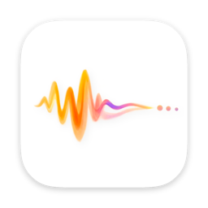
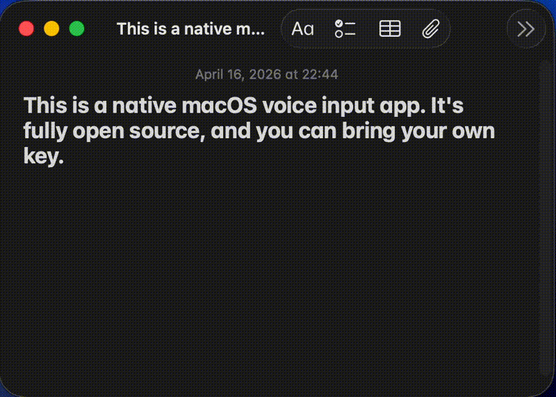

# Stet

Stet 是一款 macOS 菜单栏语音听写应用。

[English](../README.md) | 中文





## 简介

Stet 会录音、转写，并且可以把结果直接粘贴回当前应用，或者替换掉已选文本。它常驻在菜单栏，通过全局快捷键启动，目标是尽量少改动地保留原始表达。

## 特性

- 菜单栏常驻运行，不占用 Dock
- 全局快捷键开始和结束听写
- 支持麦克风测试和输入设备选择
- 支持 OpenAI 和 Groq 作为转写提供方
- 支持 `Automatic`、`Stet account`、`Your own key` 三种 AI 执行模式
- 支持中文、英文以及中英混合听写偏好
- 支持个人词典
- 支持 Sparkle 自动更新

## 系统要求

- macOS 26.0 或更高版本
- Xcode 26 或兼容版本
- 麦克风权限
- 辅助功能 / 输入控制权限，用于把文本写回当前应用

## 快速开始

在 Xcode 中打开 `Stet.xcodeproj`，让依赖自动解析后运行 `Stet` scheme。

也可以直接从仓库根目录构建：

```bash
make build
```

或者直接使用 `xcodebuild`：

```bash
xcodebuild -project Stet.xcodeproj -scheme Stet -configuration Debug -destination 'platform=macOS' build
```

### Xcode 存储治理

运行仓库自带的容量检查，可以查看 Stet、StetMobile、Xcode 共享缓存、SwiftPM 下载、Archives 和 simulator runtimes 各自占用的空间：

```bash
make doctor
```

退出 Xcode 以及其他 Swift 编辑器或构建工具后，可以只清理 Stet 与 StetMobile 可重新生成的构建缓存：

```bash
make clean-derived-data
```

清理命令使用严格的路径白名单，不会删除 Archives、签名资料、模型、已下载的 frameworks 或 simulator runtimes。

## 配置说明

首次启动时，Stet 会引导你完成权限、听写设置，以及 Stet 账号或自己的 API Key。设置里也可以调整音频输入、语言偏好、外观、更新和个人词典。

## 故障排查

### Debug 构建不弹麦克风权限窗

如果 `Stet Debug` 没有出现在系统设置里，点击 `Request Access` 也不弹 macOS 麦克风权限窗，先检查 Debug 构建配置。

- `ENABLE_RESOURCE_ACCESS_AUDIO_INPUT` 必须在 Debug 配置里设为 `YES`
- 构建产物的 entitlement 里必须包含 `com.apple.security.device.audio-input`
- 缺少这个 entitlement 时，`tccd` 会在弹窗前直接拒绝请求

### 本地构建和安装版不能共用同一个应用身份

不要让本地 Xcode 构建和 `/Applications/Stet.app` 共用同一个 bundle identifier。

- `Debug` 使用 `NaichengDeng.Stet.Debug`
- 正式分发 / 公证后的 Release 使用 `NaichengDeng.Stet`

把两者分开可以避免麦克风权限、辅助功能权限和 OAuth 回调在 TCC / Launch Services 里互相污染。

如果你之前启动过一个用 Apple Development 签名、但 bundle id 仍然是 `NaichengDeng.Stet` 的本地构建，macOS 可能已经把辅助功能授权绑定到了错误的代码需求上。这样系统设置里看起来像是“已经允许”，但运行时 `AXIsProcessTrusted()` 仍然会失败。

### 已经 Allow，但 onboarding 仍然显示麦克风未通过

如果系统权限窗已经弹出、也已经点了 `Allow`，并且 `Stet Debug` 已经出现在系统设置里，但 onboarding 仍然不能继续，问题通常不在 macOS TCC，而在应用内的权限 gate。

- 麦克风权限请求应使用 `AVAudioApplication.requestRecordPermission`
- 麦克风权限状态应读取 `AVAudioApplication.shared.recordPermission`
- 不要在 gate 判定里混用 `AVCaptureDevice.authorizationStatus(for: .audio)` 和 `AVAudioApplication`

实际录音链路仍然可以继续使用现有的 macOS 音频采集实现。这里需要统一的只是权限请求和权限状态读取。

## 测试

运行 macOS 测试：

```bash
xcodebuild -project Stet.xcodeproj -scheme Stet -destination 'platform=macOS' test
```

## 发布

这个仓库的正式发布产物只认 GitHub Actions 生成的结果，不把本地打包或本地 release 验证作为正式流程的一部分。

正式流程是：

1. 本地完成开发，并用 `make build`、`make test` 做常规验证。
2. 需要候选发布时，手动运行 `macOS Release Candidate`。
3. 从 GitHub Actions 下载 DMG artifact 做发布前验证。
4. 正式发布时，从 `main` 对应 commit 推送 `v*` tag，让 `macOS Release` 生成签名、公证后的正式产物。

发布产物写入 `dist/github-release/<tag>/`，更完整的 CI/CD 发布说明见：[release.zh-CN.md](release.zh-CN.md)。

## 许可证

[GNU General Public License v3.0 (GPL-3.0-only)](../LICENSE)
