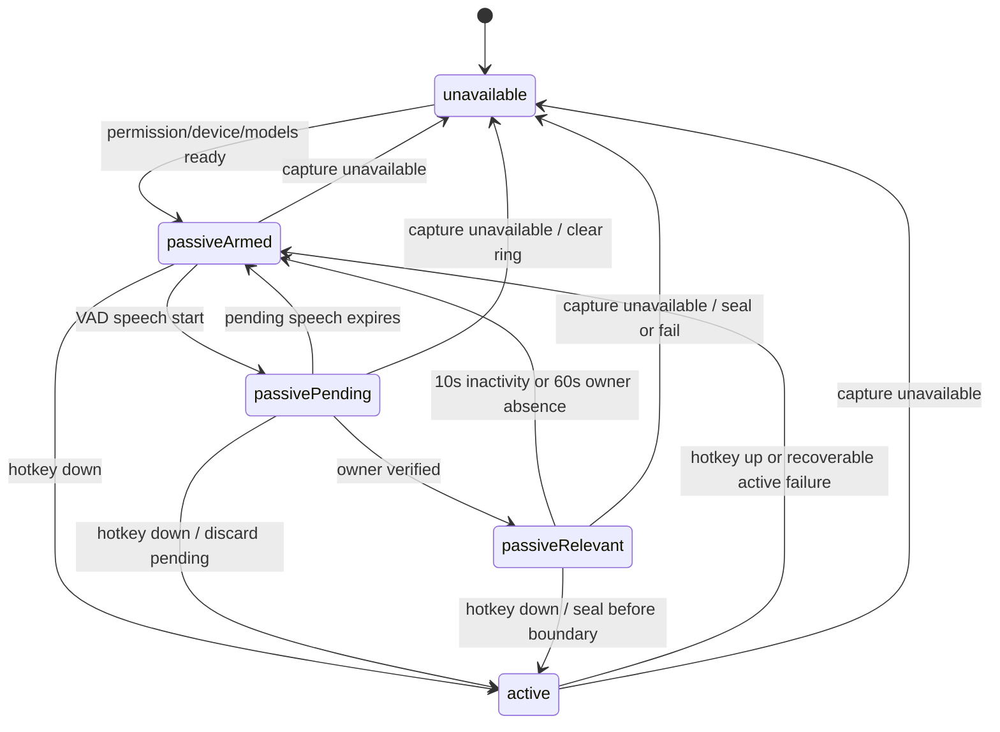

# Data Model: Unified Speech Capture and Contextual Passive Listening

## Overview

The model separates transient audio-control state from the small amount of accepted, user-visible data. Pending audio and inference work never become domain records. Accepted active or passive text uses the existing history store.

## Persisted entities

### Speaker Profile

Represents one explicitly enrolled voice identity.

| Attribute | Meaning |
|---|---|
| `id` | Stable UUID referenced by known-speaker regions |
| `displayName` | User-visible name; owner may display as “Me” |
| `role` | `owner` or `known` |
| `embeddingModelID` | Stable model-family identifier |
| `embeddingModelRevision` | Exact model revision used for enrollment |
| `embeddingDimension` | Expected centroid vector dimension |
| `normalizedCentroid` | L2-normalized aggregate voice embedding |
| `enrollmentSampleCount` | Number of accepted enrollment clips contributing to the centroid |
| `matchThreshold` | Calibrated minimum cosine similarity for this profile/model |
| `createdAt`, `updatedAt` | Audit timestamps for local profile management |
| `status` | `ready` or `requiresReenrollment` |

Invariants:

- Exactly zero or one profile has role `owner`; passive relevance cannot arm without a `ready` owner.
- At most four profiles are enabled in this feature: one owner and three known speakers.
- Every centroid is finite, non-empty, L2-normalized, and matches `embeddingDimension`.
- Model ID, revision, and dimension must match the loaded verifier or the profile becomes `requiresReenrollment`.
- Enrollment audio and individual clip embeddings are not attributes and are never persisted.
- A profile is assigned only after threshold and runner-up separation checks; otherwise the result is open-set `other`/`unresolved`.
- Deleting a profile deletes its Keychain centroid. Existing historical regions retain their stable profile ID and display-name snapshot but cannot be used as biometric templates.

Persistence: all profiles are one Codable, local-only, non-synchronizing Keychain data item. They are excluded from transcript export, logs, analytics, and cloud sync.

### History Entry extensions

The existing `HistoryEntry` remains the parent record.

| New attribute | Meaning |
|---|---|
| `captureMode` | `active` or `passive` |
| `captureStartedAt` | Wall-clock start time of the accepted interval |
| `captureEndedAt` | Wall-clock end time after sealing; nil while open |
| `processingState` | `processing`, `completed`, or `failed` |
| `processingFailureCode` | Stable optional failure category; no fabricated text |
| `speakerRegionsData` | Encoded ordered `[SpeakerRegion]`; empty for ordinary active entries |

Existing text attributes retain their meaning. For a passive entry:

- `rawText` is the ordered concatenation of unmodified per-turn Nano results.
- `llmText` is nil because passive capture does not rewrite.
- `finalText` is nil because nothing is delivered to another app.
- delivery status is `notDelivered` rather than pretending the entry was pasted.

Migration invariants:

- Existing entries decode as `captureMode = active`, `processingState = completed`, and empty speaker regions.
- Existing explicit engine choices and history text are not rewritten during migration.
- A failed passive entry may retain already completed turns and a failure code, but never raw audio.

### Speaker Region

An ordered child value encoded inside its `HistoryEntry`.

| Attribute | Meaning |
|---|---|
| `id` | Stable UUID within the history entry |
| `startMilliseconds`, `endMilliseconds` | Half-open audio-time range relative to `captureStartedAt` |
| `speakerIdentity` | `self`, `known(profileID, displayNameSnapshot)`, `other`, or `unresolved` |
| `text` | Exact trimmed ASR text returned for this turn; may be empty after a recoverable ASR failure |
| `identitySimilarity` | Optional cosine similarity; not a probability |
| `activityConfidence` | Optional diarizer speech-activity confidence; not identity confidence |
| `isOverlap` | Whether more than one Sortformer track was active |

Invariants:

- Regions are sorted by start time and fall inside the parent capture interval.
- Non-overlap regions do not overlap one another after adjacent same-identity merging.
- An overlap union is stored once and has identity `unresolved`; it is never duplicated into two speakers.
- `known` includes a display-name snapshot so deleting/renaming a current profile does not rewrite history.
- Low-confidence or too-short regions are `unresolved`; `other` means there was sufficient evidence that no enabled profile matched.
- `rawText` preserves region text order without semantic rewriting.

## Transient entities

### Listening Session

Owns the current `state`, monotonically increasing `epoch`, capture device identity, and the monotonic sample clock. It is never persisted.

State transitions:

### Pending Context Buffer

An in-memory circular sequence of normalized sample blocks and monotonic sample ranges.

Invariants:

- Capacity is 15 seconds (about 0.96 MB at 16 kHz Float32).
- At most 0.4 seconds of pre-roll remains while armed.
- Buffer order follows the capture sample clock; eviction never reorders or duplicates blocks.
- It has no filesystem URL and is cleared on expiry, error, profile disablement, hotkey takeover, device change, or epoch change.

### Relevant Conversation

An accepted passive session with a stable UUID, open/close timestamps, `lastSpeechAt`, `lastOwnerAt`, ordered accepted blocks, Sortformer track state, and serialized Nano work queue.

Invariants:

- It exists only after owner verification in the same epoch.
- Its first accepted block may precede the owner match but cannot precede the retained 15-second snapshot.
- Later other-speaker turns remain accepted until inactivity or owner-absence closure.
- A VAD endpoint or 30-second hard cap seals processing work; it does not create a second history entry.
- Only one relevant conversation is open.

### Speaker Gate Decision

Carries `epoch`, candidate range, owner profile ID, cosine similarity, configured threshold, and the accepted/rejected outcome. It exists for control/diagnostics only and is not persisted as a separate record.

### Accepted Work Item

Carries a conversation ID, epoch, ordered sample range, tentative speaker-track identity, and optional dedicated temporary WAV URL. Its file is removed on every terminal path.

## Relationships

- One listening session has zero or one pending buffer and zero or one relevant conversation.
- One relevant conversation creates one passive history entry and many ordered speaker regions.
- A speaker region may reference one speaker profile by stable ID, but the profile never references history.
- Active capture creates ordinary history entries and has no relationship to passive pending/relevant state.
- A capture sample range belongs to exactly one epoch and one mode.
