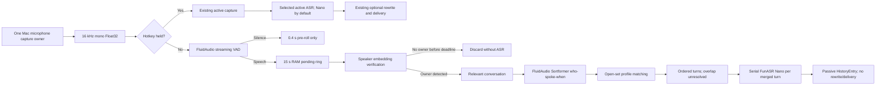

# Implementation Plan: Unified Speech Capture and Contextual Passive Listening

**Branch**: `009-passive-speech-gate` | **Date**: 2026-08-03 | **Spec**: [spec.md](./spec.md)
**Input**: Feature specification from `/specs/009-passive-speech-gate/spec.md`

## Summary

Add an all-day Mac passive-listening path around the existing single microphone capture owner. A lightweight FluidAudio streaming VAD is the only inference that runs on silence. Detected speech enters a 15-second in-memory ring and is checked with a local speaker-embedding verifier. A match to the owner opens a relevant conversation; only then does Stet replay the retained audio through FluidAudio Sortformer diarization and serial FunASR Nano transcription. Active hotkey capture atomically suspends passive ownership and keeps its current “accept every speaker” behavior.

Speaker identity is open-set: one owner and up to three explicitly enrolled known speakers may be named, while unmatched speech remains `other` and overlapping or low-confidence speech remains `unresolved`. Enrollment audio is discarded after a normalized centroid embedding is created; only the embedding and its model metadata are persisted locally. Mac defaults to FunASR Nano, iPhone defaults to FunASR Realtime, and SenseVoice is removed from selectable engines. Passive transcripts bypass rewrite and delivery.

## Technical Context

**Language/Version**: Swift 5.10; C++17 only where the existing FunASR runtime already requires it; Python 3.10+ for the existing calibration probe
**Primary Dependencies**: AVFoundation/AVCapture, FluidAudio pinned at `0346057d8245b5e7ace6965d499f85d93e803ef1`, existing SherpaOnnxPackage speaker-embedding API, existing FunASRRuntime, SwiftData, Security/Keychain
**Storage**: SwiftData `HistoryEntry` for accepted transcript metadata and speaker regions; local non-synchronizing Keychain item for aggregate speaker profiles; raw pending audio only in RAM; accepted turn WAVs only in a dedicated temporary directory
**Testing**: Swift Testing/XCTest in `StetMacTests`, `StetEngine` package tests, and `StetMobileTests`; deterministic fake clock/audio/inference adapters; manual real-voice fixtures and Instruments Energy validation
**Target Platform**: macOS 14+ for active and passive capture; iOS 17+ for active FunASR Realtime capture
**Project Type**: macOS app + private iOS app + shared Swift package in the canonical monorepo
**Performance Goals**: zero verifier, diarizer, and ASR calls during silence; under one second to evict expired pending audio; at least 90% owner-gate recall and 95% other-only rejection on the evaluation corpus; stable eight-hour passive session
**Constraints**: one microphone capture owner; 16 kHz mono Float32 internal stream; about 0.96 MB for the 15-second ring; no pending-audio disk writes; no rewrite for passive text; no duplicate samples across active/passive boundaries; Sortformer supports at most four concurrent speaker tracks
**Scale/Scope**: one Mac user, one owner profile plus at most three known profiles, one active relevant conversation, and one serialized local Nano work queue

## Constitution Check

*GATE: Passed before research and re-checked after design.*

- `spec.md` contains prioritized independent stories, edge cases, measurable outcomes, assumptions, and scope boundaries.
- This `plan.md` contains the implementation strategy and repository structure without duplicating the task list.
- `data-model.md` defines persisted and transient entities, stable identifiers, relationships, transitions, and invariants without storage-framework wiring.
- `contracts/history-capture.md` and `contracts/transcription-engines.md` document the changed public cross-module interfaces, including inputs, outputs, errors, constraints, and examples. Mac-private capture and inference adapters are intentionally absent from `contracts/`.
- `research.md` resolves the VAD, diarization, identity, buffering, alignment, privacy, engine-default, and removal decisions.
- `tasks.md` is intentionally not produced during design and will be generated from these artifacts later.
- Public/private repository boundaries are preserved: shared/macOS changes stay under `Public/Stet`, while iPhone changes stay under `Private/StetMobile`.
- No constitution violations require a complexity exception.

## Architecture



### Capture ownership and state

One actor, `MacPassiveListeningCoordinator`, serializes microphone frames, VAD events, inference results, deadlines, and hotkey transitions. It owns a monotonically increasing capture epoch. Every asynchronous verifier, diarizer, and ASR result carries the epoch and conversation ID; stale results are ignored.

The five states are:

1. `unavailable(reason)` — permission, device, or required model is unavailable.
2. `passiveArmed` — VAD is resident; only the pre-roll is retained.
3. `passivePending` — speech exists in the bounded ring and owner participation is unresolved.
4. `passiveRelevant(conversationID)` — the owner was detected; retained and subsequent turns are accepted.
5. `active` — the hotkey owns capture; passive VAD, verification, and relevance maintenance are suspended.

`hotkeyDown` is an atomic sample-boundary transition. Pending audio is discarded; an already relevant passive conversation is sealed immediately before the boundary; crossing buffers are split; the new epoch belongs exclusively to active capture. `hotkeyUp` seals active capture, increments the epoch, clears prior context, and immediately returns to `passiveArmed`. Active-start failure also returns to `passiveArmed` when capture remains healthy.

Passive listening has one persisted, default-on setting in the existing audio settings store. Turning it off stops and clears only passive ownership. If active capture owns the shared microphone when the setting or audio-device list changes, teardown is deferred until the active interval has finished so the active recording window cannot be invalidated.

### VAD and buffering

Use FluidAudio's existing `VadManager.makeStreamState()` and `processStreamingChunk` APIs. The initial internal configuration is:

| Parameter | Initial value | Purpose |
|---|---:|---|
| Internal format | 16 kHz mono Float32 | One conversion shared by all passive stages |
| VAD probability threshold | `0.60` | Preserve the existing Stet operating point; calibratable |
| Speech-start duration | `0.25 s` | Reject clicks and very short noise |
| Speech-end silence | `1.0 s` | Preserve natural within-turn pauses |
| Pre-roll | `0.4 s` | Protect first phonemes |
| Owner-verification window / hop | `2.0 s / 0.5 s` | Bound gate latency while accumulating enough voice |
| Minimum voiced content for identity | `1.2 s` | Leave very short identity evidence unresolved |
| Pending lookback/deadline | `15 s` | Recover another-first openings with bounded memory |
| Relevant inactivity timeout | `10 s` | Close normal conversation gaps |
| Maximum owner absence | `60 s` | Prevent an admitted office conversation from running forever |
| Processing hard cap | `30 s` | Bound a single accepted Nano work item |

These values live together in one internal, test-injectable value type because microphone and room conditions require calibration. No user-facing tuning UI is added in this feature.

The ring stores samples and monotonic sample ranges in memory. Other-only audio is overwritten as the 15-second window advances and never reaches disk or ASR. Once relevance opens, an ordered snapshot becomes accepted audio. Accepted turns may be written to dedicated temporary WAVs only immediately before the file-only Nano API is called; success, failure, cancellation, and hotkey preemption remove them. Startup removes only orphan files with the feature's exact temporary-file prefix.

### Speaker verification, diarization, and labels

Use the existing SherpaOnnx speaker-embedding runtime with the already tested 3D-Speaker CAMPPlus model for durable identity. Enrollment creates an L2-normalized centroid from several clean VAD-approved clips and immediately discards the audio and per-clip embeddings. The runtime compares detected-speech windows to the owner centroid to open a relevant conversation.

After admission, replay the retained audio and all continuing speech through FluidAudio `SortformerDiarizer(config: .default)`. Sortformer supplies stable speaker tracks and overlap timing; it does not supply durable identities. For each finalized, non-overlapping track region with enough speech, the same embedding extractor compares a region/track centroid against all enabled profiles. Assign a profile only when both its calibrated threshold and separation margin from the runner-up pass. Otherwise label the region `other`; regions too short to classify, below the activity threshold, or containing overlap are `unresolved`.

Do not use `DiarizerSegment.confidence` as identity confidence: in the pinned FluidAudio revision it is average speaker-activity probability. Persist identity cosine similarity and activity confidence as separate optional scores, and do not present either as a calibrated probability.

FluidAudio Sortformer enrollment is not used for persistent identity because its enrollment exists only inside one diarizer instance and requires replaying original enrollment audio after launch. The embedding/Sortformer split avoids retaining biometric source recordings while still using FluidAudio for diarization.

### Transcription and text alignment

Active capture continues to submit its complete hotkey interval to the selected engine. On Mac, the app stops running `DefaultAudioPostProcessor`'s batch VAD/precise trim before Nano; Nano's built-in VAD remains responsible for final active ASR segmentation. On iPhone, FunASR Realtime continues to use server endpointing. A forced cross-platform VAD abstraction is not introduced because the two engines consume audio differently.

Passive text must carry a speaker label. The current Nano API returns only one string for a file and has no word timestamps, so string-length or character-position alignment is forbidden. Instead, merge adjacent finalized diarization regions with the same resolved identity, add at most 0.2 seconds of neighboring non-speech padding without crossing another speaker or duplicating a sample, create one temporary WAV per ordered turn (or unresolved overlap union), and call the existing Nano file API serially. The turn's returned text is stored directly with that time range. A 30-second hard cap may divide a long turn into consecutive work items without creating a new conversation entry.

This deliberately trades extra Nano calls for correct speaker-to-text association and avoids changing the C++ runtime. If measured accuracy later requires cross-turn linguistic context, that is the point to add timestamped ASR output; it is not part of this design.

### Persistence and privacy

Extend the existing `HistoryEntry` instead of creating a parallel passive-history store. Passive entries are created when relevance opens, updated with ordered completed turns, and finalized or failed when the conversation closes. They record capture mode and interval, processing state/failure, and encoded speaker regions. Old entries migrate as active captures with no speaker regions. Passive entries have no rewrite text, no target application, and a non-delivered delivery state.

Speaker profiles are stored as one Codable data item in a new local-only, non-synchronizing Keychain store. The current `KeychainSecretStore` is not reused because it explicitly enables synchronization. Profiles never appear in history export, logs, analytics, or cloud sync. A model ID/revision/dimension mismatch disables a profile until re-enrollment. Deleting one profile or all profiles removes the corresponding centroid data.

### Engine defaults and SenseVoice removal

- Change `StoredTranscriptionEngine.default` to `.funASRNano`; preserve explicit choices that still decode. A retired `sherpaOnnxSenseVoice` raw value falls back once to Nano and is persisted as the replacement.
- Stop onboarding/language routing from overriding the Mac default with SenseVoice, and make Nano model preparation the new-install path.
- Change iPhone's default and retired SenseVoice migration target to `.funASRRealtime`; keep the existing Realtime engine, audio capture, websocket endpointing, and active coordinator semantics.
- Remove SenseVoice choices, model managers, downloads, and engine branches on both platforms. Keep `SherpaOnnxPackage` and only the speaker-embedding surface required by passive identity; removing SenseVoice does not authorize removing that runtime.
- Keep FluidAudio in the Mac app target. Do not move Mac-only passive processing into the shared package.

## Project Structure

### Documentation (this feature)

```text
specs/009-passive-speech-gate/
├── spec.md
├── plan.md
├── research.md
├── data-model.md
├── quickstart.md
├── contracts/
│   ├── history-capture.md
│   └── transcription-engines.md
└── tasks.md                 # generated later, not by this design phase
```

### Source Code (repository root)

```text
Public/Stet/
├── Packages/StetEngine/
│   ├── Sources/StetASR/
│   │   ├── SpeakerEmbeddingRecognizer.swift        # new thin CAMPPlus wrapper
│   │   └── SenseVoice*.swift                       # remove retired ASR surface
│   ├── Sources/StetCore/
│   │   ├── StoredTranscriptionEngine.swift         # Nano default; remove SenseVoice
│   │   ├── HistoryEntry.swift                      # capture metadata + speaker regions
│   │   └── DictationHistoryService.swift           # passive capture persistence API
│   └── Tests/
├── StetMac/
│   ├── App/Workflows/
│   │   ├── MacAppSessionController+Dictation.swift # atomic hotkey handoff
│   │   └── MacDictationHotkeyInteraction.swift
│   ├── Core/Audio/
│   │   ├── Capture/MacCaptureAudioFileRecorder.swift
│   │   └── Recording/MacRecordingFileSupport.swift # one stream owner + bounded RAM ring
│   ├── Core/FluidAudio/
│   │   └── FluidAudioPassiveSpeechAnalyzer.swift   # streaming VAD + Sortformer adapter
│   ├── Core/Speech/
│   │   ├── MacPassiveListeningCoordinator.swift    # five-state actor
│   │   ├── SpeakerProfileStore.swift               # local Keychain data
│   │   └── ConfigurableSpeechService.swift         # active path skips batch trimming for Nano
│   ├── Core/SenseVoice/                             # remove
│   └── Features/Onboarding, Features/MacShell/      # defaults, enrollment, mic state
└── StetMacTests/
    ├── Core/Speech/MacPassiveListeningCoordinatorTests.swift
    ├── Core/Audio/MacRecordingFileSupportTests.swift
    └── Core/FluidAudio/FluidAudioPassiveSpeechAnalyzerTests.swift

Private/StetMobile/
├── StetMobile/
│   ├── App/StetMobileApp.swift                      # Realtime-only composition
│   └── Core/Settings/LocalDictationModelManager.swift
└── StetMobileTests/
    └── FunASRSettingsTests.swift                    # defaults and retired-value migration
```

**Structure Decision**: Passive orchestration remains Mac-private because iPhone has no all-day passive requirement. Only capture-history value types and the speaker-embedding wrapper live in `StetEngine`, where the current public history and Sherpa runtime already reside. The existing active coordinators are preserved instead of replacing both platforms with a speculative common pipeline.

## Delivery Sequence

1. Change engine defaults and remove SenseVoice branches while retaining the Sherpa speaker-embedding dependency; keep both apps building.
2. Add shared capture-history values, migration defaults, and the passive persistence contract.
3. Add the local-only speaker-profile store and enrollment/embedding flow; calibrate thresholds with the existing Python probe and real voice fixtures.
4. Convert the Mac capture owner to expose its normalized live buffers and implement the bounded ring plus streaming FluidAudio VAD.
5. Add the five-state passive coordinator, epoch-based hotkey handoff, owner gate, deadlines, cleanup, and recovery with fake inference tests.
6. Add Sortformer replay/streaming, open-set region identity, per-turn Nano transcription, and passive history updates.
7. Wire microphone-state visibility and minimal profile enrollment/deletion UI, then complete eight-hour memory/energy and real-speaker acceptance tests.

## Complexity Tracking

No constitution violations. The design adds one state coordinator because microphone ownership and hotkey preemption must be serialized, and retains two existing inference dependencies because FluidAudio provides streaming VAD/diarization while Sherpa provides durable embeddings without storing enrollment audio.
